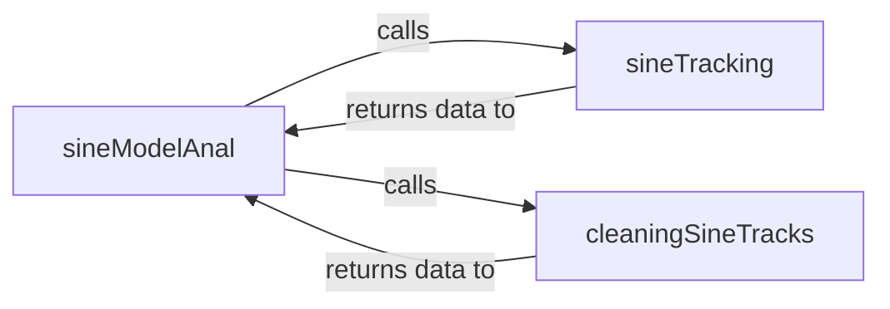

## Details

The Sine Model Processor subsystem is primarily defined by the smstools.models.sineModel module, located in smstools/models/sineModel.py. This module encapsulates the core logic for identifying, tracking, and refining sinusoidal components in audio signals.

### sineModelAnal
This component serves as the orchestrator and primary control flow for the entire sine model analysis process. It initiates and manages the sequence of operations required to analyze and synthesize sinusoidal components, acting as the entry point for the sinusoidal analysis workflow.

**Related Classes/Methods**:

- <a href="https://github.com/MTG/sms-tools/blob/master/smstools/models/sineModel.py" target="_blank" rel="noopener noreferrer">`smstools.models.sineModel:sineModelAnal`</a>

### sineTracking
Responsible for the core data transformation of extracting and tracking individual sinusoidal components from the input audio's spectral features. This component performs the initial identification and continuous tracking of sine waves, forming the fundamental analysis step.

**Related Classes/Methods**:

- <a href="https://github.com/MTG/sms-tools/blob/master/smstools/models/sineModel.py" target="_blank" rel="noopener noreferrer">`smstools.models.sineModel:sineTracking`</a>

### cleaningSineTracks
Focuses on refining the output of the sineTracking component. Its role is to enhance the quality and accuracy of the tracked sine components, potentially by filtering out noise, merging redundant tracks, or correcting inaccuracies, ensuring high-fidelity results.

**Related Classes/Methods**:

- <a href="https://github.com/MTG/sms-tools/blob/master/smstools/models/sineModel.py" target="_blank" rel="noopener noreferrer">`smstools.models.sineModel:cleaningSineTracks`</a>

### [FAQ](https://github.com/CodeBoarding/GeneratedOnBoardings/tree/main?tab=readme-ov-file#faq)