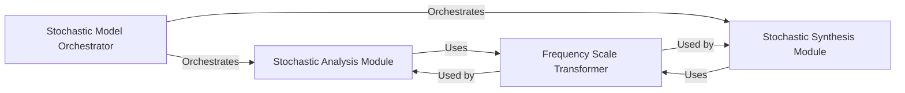

## Details

The Stochastic Model Processor subsystem is encapsulated within the smstools.models.stochasticModel class and its associated methods and nested classes, primarily located in /mnt/e/StartUp/sms-tools/smstools/models/stochasticModel.py. This class acts as the central hub for managing the analysis and synthesis of non-harmonic, noise-like audio components.

### Stochastic Model Orchestrator
This component serves as the primary interface and orchestrator for the entire stochastic audio modeling process. It defines the common parameters and coordinates the execution flow between the analysis and synthesis phases, embodying the core "model" in this data processing library.

**Related Classes/Methods**:

- <a href="https://github.com/MTG/sms-tools/blob/master/smstools/models/stochasticModel.py" target="_blank" rel="noopener noreferrer">`smstools.models.stochasticModel`</a>

### Stochastic Analysis Module
Responsible for the analysis phase, this module processes input audio data to extract and characterize non-harmonic, noise-like components. It applies specific algorithms to identify and parameterize the stochastic elements of the sound.

**Related Classes/Methods**:

- <a href="https://github.com/MTG/sms-tools/blob/master/smstools/models/stochasticModel.py#L27-L79" target="_blank" rel="noopener noreferrer">`smstools.models.stochasticModel.stochasticModelAnal`:27-79</a>

### Stochastic Synthesis Module
This module handles the synthesis phase, reconstructing audio output based on the stochastic parameters obtained from analysis or predefined models. It generates the noise-like components and integrates them into the final audio signal, completing the processing pipeline.

**Related Classes/Methods**:

- <a href="https://github.com/MTG/sms-tools/blob/master/smstools/models/stochasticModel.py#L82-L120" target="_blank" rel="noopener noreferrer">`smstools.models.stochasticModel.stochasticModelSynth`:82-120</a>

### Frequency Scale Transformer
A utility component providing essential frequency scale transformations, such as converting frequencies from the Hertz scale to the Mel scale. This module is crucial for processing audio data in a perceptually meaningful way, supporting both analysis and synthesis operations within the stochastic model.

**Related Classes/Methods**:

- <a href="https://github.com/MTG/sms-tools/blob/master/smstools/models/stochasticModel.py#L13-L17" target="_blank" rel="noopener noreferrer">`smstools.models.stochasticModel.hertz_to_mel`:13-17</a>

### [FAQ](https://github.com/CodeBoarding/GeneratedOnBoardings/tree/main?tab=readme-ov-file#faq)