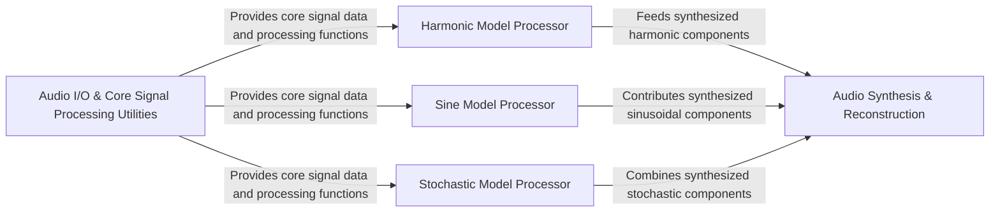

## Details

The `sms-tools` library implements a sophisticated audio processing pipeline, centralizing around a core `Audio I/O & Core Signal Processing Utilities` component that handles foundational signal manipulation. This core feeds raw or pre-processed audio data into three specialized `Model Processors`—Harmonic, Sine, and Stochastic—each responsible for analyzing and synthesizing distinct perceptual components of sound. This modular design allows for independent processing of pitched, tonal, and noise elements. The outputs from these individual processors are then aggregated by the `Audio Synthesis & Reconstruction` stage, which combines the separated components to reconstruct a complete audio signal. This architecture facilitates flexible and detailed manipulation of audio, making it ideal for applications requiring granular control over sound characteristics.

### Audio I/O & Core Signal Processing Utilities
Handles fundamental audio input/output, basic signal processing operations, and provides essential mathematical utilities and transformations (e.g., DFT).

**Related Classes/Methods**:

- <a href="https://github.com/MTG/sms-tools/blob/master/smstools/models/utilFunctions.py" target="_blank" rel="noopener noreferrer">`smstools.models.utilFunctions`</a>
- <a href="https://github.com/MTG/sms-tools/blob/master/smstools/models/dftModel.py" target="_blank" rel="noopener noreferrer">`smstools.models.dftModel`</a>

### Harmonic Model Processor [[Expand]](./Harmonic_Model_Processor.md)
Analyzes and synthesizes the harmonic (pitched) components of an audio signal, identifying fundamental frequencies and tracking harmonics.

**Related Classes/Methods**:

- <a href="https://github.com/MTG/sms-tools/blob/master/smstools/models/harmonicModel.py" target="_blank" rel="noopener noreferrer">`smstools.models.harmonicModel`</a>

### Sine Model Processor [[Expand]](./Sine_Model_Processor.md)
Focuses on the precise identification, tracking, and refinement of individual sinusoidal components in audio for detailed spectral analysis.

**Related Classes/Methods**:

- <a href="https://github.com/MTG/sms-tools/blob/master/smstools/models/sineModel.py" target="_blank" rel="noopener noreferrer">`smstools.models.sineModel`</a>

### Stochastic Model Processor [[Expand]](./Stochastic_Model_Processor.md)
Manages the analysis and synthesis of non-harmonic, noise-like (stochastic) components of audio, including frequency scale transformations.

**Related Classes/Methods**:

- <a href="https://github.com/MTG/sms-tools/blob/master/smstools/models/stochasticModel.py" target="_blank" rel="noopener noreferrer">`smstools.models.stochasticModel`</a>

### Audio Synthesis & Reconstruction [[Expand]](./Audio_Synthesis_Reconstruction.md)
A conceptual component representing the final stage where processed outputs from the individual model processors are combined to reconstruct the complete audio signal.

**Related Classes/Methods**:

- <a href="https://github.com/MTG/sms-tools/blob/master/smstools/models/harmonicModel.py" target="_blank" rel="noopener noreferrer">`smstools.models.harmonicModel`</a>
- <a href="https://github.com/MTG/sms-tools/blob/master/smstools/models/sineModel.py" target="_blank" rel="noopener noreferrer">`smstools.models.sineModel`</a>
- <a href="https://github.com/MTG/sms-tools/blob/master/smstools/models/stochasticModel.py" target="_blank" rel="noopener noreferrer">`smstools.models.stochasticModel`</a>

### [FAQ](https://github.com/CodeBoarding/GeneratedOnBoardings/tree/main?tab=readme-ov-file#faq)