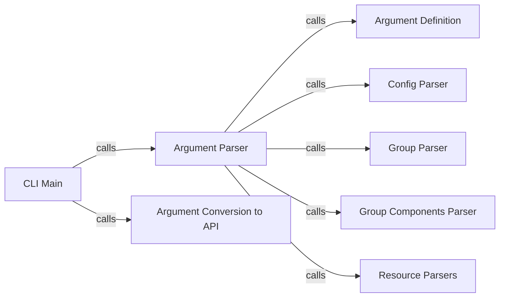

## Component Details

The Command Line Interface (CLI) component of Snakemake provides the entry point for users to interact with the workflow engine. It handles parsing command-line arguments, configuring the Snakemake workflow based on these arguments, and initiating the workflow execution. The CLI component orchestrates the entire process, from argument parsing to API call, ensuring that the workflow is set up correctly before execution.

### CLI Main
The `main` function serves as the primary entry point for the Snakemake CLI. It orchestrates the entire process, from parsing command-line arguments to initiating the Snakemake workflow execution. It calls other functions to parse arguments, handle specific options, and finally pass the configuration to the Snakemake API.
- **Related Classes/Methods**: `snakemake.src.snakemake.cli:main`

### Argument Parser
The `parse_args` function is responsible for parsing command-line arguments. It uses the `argparse` module to define the arguments and their types, and then parses the actual arguments provided by the user. It calls other parsing functions to handle specific options like config files, groups, and resource definitions.
- **Related Classes/Methods**: `snakemake.src.snakemake.cli:parse_args`

### Argument Definition
The `get_argument_parser` function defines and returns the `argparse.ArgumentParser` object used for parsing command-line arguments. It specifies all available arguments, their types, help messages, and default values. This parser is then used by `parse_args` to actually parse the arguments.
- **Related Classes/Methods**: `snakemake.src.snakemake.cli:get_argument_parser`

### Config Parser
The `parse_config` function handles the parsing of configuration options provided via the command line (e.g., `--config` or `--configfiles`). These options are used to configure the Snakemake workflow. It extracts the configuration values from the command-line arguments and makes them available for use by the Snakemake API.
- **Related Classes/Methods**: `snakemake.src.snakemake.cli:parse_config`

### Argument Conversion to API
The `args_to_api` function transforms the parsed command-line arguments (stored in the `argparse.Namespace` object) into a dictionary or object suitable for use by the Snakemake API. It maps argument names to API parameter names and converts values as needed. This ensures that the arguments are in the correct format for the Snakemake workflow execution.
- **Related Classes/Methods**: `snakemake.src.snakemake.cli:args_to_api`

### Group Parser
The `parse_groups` function parses the group definitions provided via the command line. These groups are used for resource grouping and scheduling within the Snakemake workflow. It extracts the group definitions from the command-line arguments and makes them available for use by the Snakemake API.
- **Related Classes/Methods**: `snakemake.src.snakemake.cli:parse_groups`

### Group Components Parser
The `parse_group_components` function parses the group components definitions provided via the command line. It extracts the group components definitions from the command-line arguments and makes them available for use by the Snakemake API.
- **Related Classes/Methods**: `snakemake.src.snakemake.cli:parse_group_components`

### Resource Parsers
The resource parsers (`parse_set_resources`, `parse_set_threads`, `parse_set_ints`, `parse_set_resource_scope`, `parse_set_scatter`) handle parsing of resource-related options provided via the command line. They extract the resource options from the command-line arguments and makes them available for use by the Snakemake API.
- **Related Classes/Methods**: `snakemake.src.snakemake.cli:parse_set_resources`, `snakemake.src.snakemake.cli:parse_set_threads`, `snakemake.src.snakemake.cli:parse_set_ints`, `snakemake.src.snakemake.cli:parse_set_resource_scope`, `snakemake.src.snakemake.cli:parse_set_scatter`
