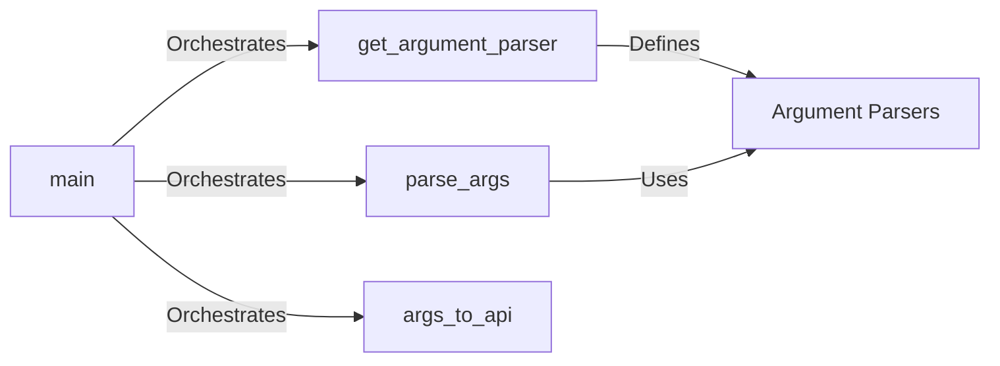

## Component Details

The Command Line Interface (CLI) in Snakemake is the entry point for users to interact with the system. It handles parsing command-line arguments, validating them, and converting them into a format suitable for the Snakemake API. The CLI orchestrates the entire process, from defining the argument parser to initiating workflow execution, and handles potential errors that may arise during this process. It ensures that user-specified configurations and execution parameters are correctly interpreted and applied to the Snakemake workflow.

### main
The `main` function serves as the primary entry point for the Snakemake CLI. It orchestrates the entire command-line parsing process, calling functions to define the argument parser, parse the arguments provided by the user, and convert them into a format suitable for the Snakemake API. It also handles any errors that occur during the process, ensuring a smooth and reliable user experience.
- **Related Classes/Methods**: `snakemake.src.snakemake.cli:main`

### get_argument_parser
This component defines the argument parser using the `argparse` module. It specifies all available command-line arguments, including their types, default values, and help messages. The argument parser provides a structured way to define and manage the various options and parameters that users can specify when running Snakemake from the command line.
- **Related Classes/Methods**: `snakemake.src.snakemake.cli:get_argument_parser`

### parse_args
The `parse_args` function is responsible for parsing the command-line arguments provided by the user. It validates these arguments and stores their values in a namespace, making them accessible for further processing. This component ensures that the user-provided input is correctly interpreted and that any invalid or missing arguments are handled appropriately.
- **Related Classes/Methods**: `snakemake.src.snakemake.cli:parse_args`

### args_to_api
This component transforms the parsed command-line arguments into a dictionary or object that can be readily used by the Snakemake API. This involves converting argument values to the correct types and handling any necessary transformations or mappings. The `args_to_api` function ensures that the command-line arguments are seamlessly integrated into the Snakemake workflow execution process.
- **Related Classes/Methods**: `snakemake.src.snakemake.cli:args_to_api`

### Argument Parsers
This encompasses a suite of functions responsible for parsing and validating specific command-line arguments related to various Snakemake settings. These functions handle options such as the number of threads (`parse_set_threads`), ancient files (`parse_consider_ancient`), resources (`parse_set_resources`), scatter-gather (`parse_set_scatter`), resource scopes (`parse_set_resource_scope`), integer settings (`parse_set_ints`), batch processing (`parse_batch`), groups (`parse_groups`, `parse_group_components`), configuration files (`parse_config`), cores (`parse_cores`), jobs (`parse_jobs`), profile directories (`get_profile_dir`), notebook editing (`parse_edit_notebook`), and file waiting (`parse_wait_for_files`). Each function focuses on a specific argument, ensuring its validity and proper interpretation.
- **Related Classes/Methods**: `snakemake.src.snakemake.cli:parse_set_threads`, `snakemake.src.snakemake.cli:parse_consider_ancient`, `snakemake.src.snakemake.cli:parse_set_resources`, `snakemake.src.snakemake.cli:parse_set_scatter`, `snakemake.src.snakemake.cli:parse_set_resource_scope`, `snakemake.src.snakemake.cli:parse_set_ints`, `snakemake.src.snakemake.cli:parse_batch`, `snakemake.src.snakemake.cli:parse_groups`, `snakemake.src.snakemake.cli:parse_group_components`, `snakemake.src.snakemake.cli:parse_config`, `snakemake.src.snakemake.cli:parse_cores`, `snakemake.src.snakemake.cli:parse_jobs`, `snakemake.src.snakemake.cli:get_profile_dir`, `snakemake.src.snakemake.cli:parse_edit_notebook`, `snakemake.src.snakemake.cli:parse_wait_for_files`
