```mermaid
graph LR
    CLI_Argument_Parser["CLI Argument Parser"]
    Configuration_Translator["Configuration Translator"]
    Snakemake_API_Interface["Snakemake API Interface"]
    Workflow_Executor["Workflow Executor"]
    CLI_Argument_Parser -- "Parses command-line arguments" --> Configuration_Translator
    Configuration_Translator -- "Translates arguments to API configuration" --> Snakemake_API_Interface
    Snakemake_API_Interface -- "Initializes and configures the Snakemake API" --> Workflow_Executor
    Workflow_Executor -- "Executes the Snakemake workflow" --> Workflow_Executor
```

## Component Details

The Snakemake Command Line Interface (CLI) serves as the primary entry point for users to interact with the Snakemake workflow management system. It leverages the `argparse` module to parse command-line arguments, which are then used to configure and execute Snakemake workflows. The CLI translates user-provided arguments into a structured configuration that is consumed by the Snakemake API. This process involves setting up the execution environment, defining resources, specifying configuration files, and initiating the workflow execution. The CLI provides a user-friendly interface for managing and running Snakemake workflows, abstracting away much of the underlying complexity.

### CLI Argument Parser
This component is responsible for parsing command-line arguments using the `argparse` module. It defines the expected arguments, their types, and default values. The parsed arguments are then converted into a dictionary or object that can be used to configure the Snakemake workflow.
- **Related Classes/Methods**: `snakemake.src.snakemake.cli`

### Configuration Translator
This component takes the parsed command-line arguments and translates them into a configuration suitable for the Snakemake API. It maps argument values to corresponding configuration parameters, handling type conversions and validation as needed. This translation process ensures that the Snakemake API receives the correct configuration for workflow execution.
- **Related Classes/Methods**: `snakemake.src.snakemake.cli`

### Snakemake API Interface
This component acts as an interface to the Snakemake API, specifically the `SnakemakeApi` class. It uses the translated configuration to initialize and configure the Snakemake API, setting up the logger and other global configurations. This interface allows the CLI to interact with the core Snakemake functionality.
- **Related Classes/Methods**: `snakemake.src.snakemake.api.SnakemakeApi`

### Workflow Executor
This component is responsible for executing the Snakemake workflow. It takes the configured workflow object and initiates the execution process, managing the execution of rules, handling dependencies, and monitoring the progress of the workflow. This component represents the core Snakemake execution engine.
- **Related Classes/Methods**: `snakemake.src.snakemake.workflow.Workflow`
