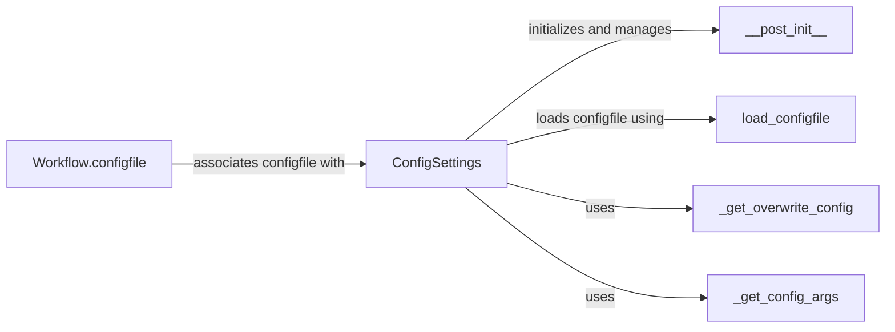

## Component Details

The Configuration Management subsystem in Snakemake is responsible for loading, parsing, and managing configuration settings that define the behavior of a workflow. It allows users to customize workflows without directly modifying the Snakefile. The core components include loading configuration files, handling command-line overrides, and providing access to configuration values during workflow execution. The `ConfigSettings` class acts as the central point for managing configuration, interacting with functions to load the initial configuration, handle overwrite configurations, and retrieve config arguments.

### ConfigSettings
The ConfigSettings class encapsulates all configuration-related settings for a Snakemake workflow. It handles loading configurations from configfiles, managing overwrite configurations specified via the command line, and providing access to these settings during workflow execution. It initializes the configuration by loading the configfile and processing any command-line overrides.
- **Related Classes/Methods**: `snakemake.src.snakemake.settings.types.ConfigSettings`

### load_configfile
The `load_configfile` function is responsible for reading and parsing the configuration file specified by the user. It loads the configuration data into a Python dictionary, which is then used to update the workflow's configuration settings. It supports various file formats like JSON and YAML.
- **Related Classes/Methods**: `snakemake.src.snakemake.common.configfile`

### Workflow.configfile
The `Workflow.configfile` function associates a configfile with the workflow. It allows the workflow to access the configuration settings defined in the configfile. It essentially sets up the config attribute of the workflow object.
- **Related Classes/Methods**: `snakemake.src.snakemake.workflow.Workflow`

### _get_overwrite_config
The `_get_overwrite_config` function retrieves overwrite configurations specified via the command line. These overwrite configurations take precedence over the settings defined in the configfile, allowing users to dynamically adjust workflow parameters.
- **Related Classes/Methods**: `snakemake.src.snakemake.settings.types.ConfigSettings`

### _get_config_args
The `_get_config_args` function retrieves config arguments passed via the command line. These arguments are used to configure the workflow, providing a flexible way to pass configuration values directly.
- **Related Classes/Methods**: `snakemake.src.snakemake.settings.types.ConfigSettings`

### __post_init__
The `__post_init__` method is called after the `ConfigSettings` object is initialized. It performs setup tasks related to configuration, such as loading the configfile and handling overwrite configurations. It ensures that the configuration is properly initialized before the workflow starts.
- **Related Classes/Methods**: `snakemake.src.snakemake.settings.types.ConfigSettings`
