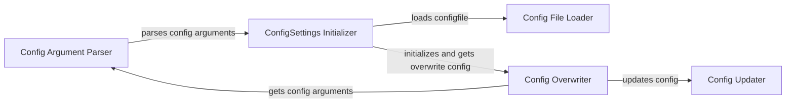

## Component Details

The Configuration Management subsystem in Snakemake is responsible for handling user-defined configurations that customize workflow behavior. It involves parsing command-line arguments related to configuration, loading configuration data from specified files, processing overwrite arguments, and merging these configurations to create a final configuration dictionary accessible to the workflow. This system allows users to modify workflow parameters without directly altering the Snakefile, promoting flexibility and reusability.

### Config Argument Parser
This component parses command-line arguments to identify the config file path and any config overwrite arguments. It extracts the relevant information needed for subsequent configuration loading and processing. It uses the `argparse` module to define and parse the expected arguments.
- **Related Classes/Methods**: `snakemake.src.snakemake.cli:parse_config`, `snakemake.src.snakemake.settings.types.ConfigSettings:_get_config_args`

### ConfigSettings Initializer
The ConfigSettings Initializer is responsible for initializing the ConfigSettings object. This involves orchestrating the loading of the config file (if specified) and applying any config overwrite arguments provided via the command line. It acts as a central point for managing the configuration loading process.
- **Related Classes/Methods**: `snakemake.src.snakemake.settings.types.ConfigSettings:__post_init__`

### Config File Loader
This component loads the configuration data from the specified config file (YAML or JSON). It reads the file and parses its contents into a Python dictionary. It uses `common.configfile.load_configfile` to load the config and handles potential errors during file reading and parsing.
- **Related Classes/Methods**: `snakemake.src.snakemake.common.configfile:load_configfile`, `snakemake.src.snakemake.workflow.Workflow:configfile`

### Config Overwriter
The Config Overwriter extracts and processes config overwrite arguments from the command line. It transforms these arguments into a dictionary that can be used to update the base configuration. It handles the conversion of command-line arguments into a usable configuration format.
- **Related Classes/Methods**: `snakemake.src.snakemake.settings.types.ConfigSettings:_get_overwrite_config`

### Config Updater
This component updates the base configuration with values from another configuration dictionary, typically used to apply overwrite config arguments. It merges the overwrite configurations into the base configuration, ensuring that the final configuration reflects the user's desired settings.
- **Related Classes/Methods**: `snakemake.src.snakemake.utils:update_config`
