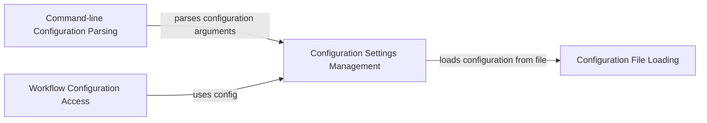

## Component Details

The Configuration Management subsystem in Snakemake is responsible for loading, merging, and providing access to configuration data during workflow execution. It involves parsing command-line arguments, reading configuration files (YAML or JSON), and managing configuration settings within the workflow. The configuration data is used to customize workflow parameters and settings without modifying the Snakefile directly.

### Command-line Configuration Parsing
This component parses command-line arguments related to configuration, identifying the configuration file to load and any overrides specified by the user. It extracts and processes these configuration-related parameters, making them available for subsequent configuration loading and merging.
- **Related Classes/Methods**: `snakemake.src.snakemake.cli:parse_config`

### Configuration Settings Management
This component manages the configuration settings for Snakemake. It handles the loading, merging, and overriding of configurations from various sources, including the configuration file and command-line arguments. It provides a unified interface for accessing configuration settings during workflow execution.
- **Related Classes/Methods**: `snakemake.src.snakemake.settings.types.ConfigSettings:__post_init__`, `snakemake.src.snakemake.settings.types.ConfigSettings:_get_overwrite_config`, `snakemake.src.snakemake.settings.types.ConfigSettings:_get_config_args`

### Configuration File Loading
This component loads the configuration from a specified configuration file, parsing its contents (typically YAML or JSON) and making them available to Snakemake. It handles file I/O and parsing errors, ensuring that the configuration data is correctly loaded and accessible.
- **Related Classes/Methods**: `snakemake.src.snakemake.common.configfile:load_configfile`

### Workflow Configuration Access
This component manages the configuration data within the Snakemake workflow. It provides access to the configuration parameters during workflow execution, allowing rules and scripts to use the configured values. It acts as a central repository for configuration data within the workflow.
- **Related Classes/Methods**: `snakemake.src.snakemake.workflow.Workflow:config`
