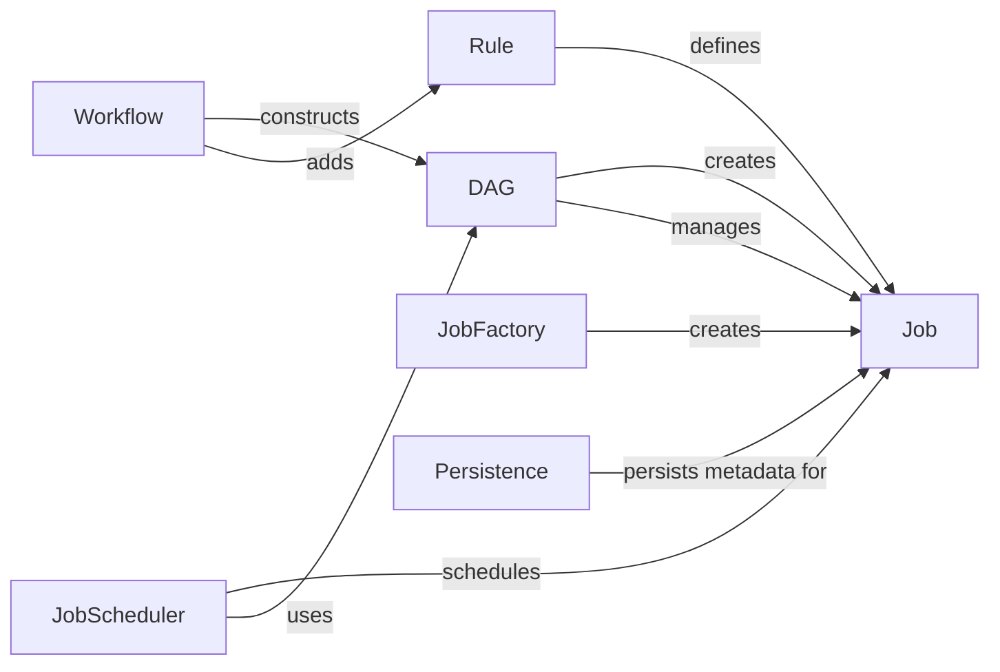

## Component Details

The DAG construction and job management subsystem is responsible for defining, managing, and executing the workflow specified in a Snakemake pipeline. It begins with the Workflow object parsing the Snakefile and creating Rule objects. These rules are then used to construct a Directed Acyclic Graph (DAG) of Job objects, representing the dependencies between jobs. The JobFactory assists in creating Job instances. The DAG ensures jobs are executed in the correct order, and the JobScheduler schedules jobs for execution based on resource availability. The Persistence component tracks job metadata to determine if re-execution is necessary. This entire process ensures the reliable and reproducible execution of the Snakemake workflow.

### Workflow
The Workflow component orchestrates the entire workflow process. It parses the Snakefile, creates Rule objects, and constructs the DAG. It serves as the entry point for defining and managing the workflow's structure.
- **Related Classes/Methods**: `snakemake.src.snakemake.workflow.Workflow`

### Rule
The Rule component defines a single rule within the workflow. It specifies input files, output files, parameters, and the shell command or script to execute. Rules are the fundamental building blocks of the DAG, defining the individual steps in the workflow.
- **Related Classes/Methods**: `snakemake.src.snakemake.rules.Rule`

### DAG
The DAG component represents the directed acyclic graph of jobs. It manages job dependencies, updates job status, handles temporary files, and provides methods for traversing the graph. It ensures that jobs are executed in the correct order based on their dependencies.
- **Related Classes/Methods**: `snakemake.src.snakemake.dag.DAG`

### Job
The Job component represents a single job in the DAG, corresponding to the execution of a rule with specific input files and parameters. It manages job-specific resources, logging, and output handling. Each job represents a concrete execution of a rule.
- **Related Classes/Methods**: `snakemake.src.snakemake.jobs.Job`

### JobFactory
The JobFactory component is responsible for creating Job instances from Rule definitions and input/output file specifications. It encapsulates the logic for instantiating jobs based on the workflow's rules and data.
- **Related Classes/Methods**: `snakemake.src.snakemake.jobs.JobFactory`

### Persistence
The Persistence component handles the persistence of job metadata, such as input file checksums and code versions, to determine whether a job needs to be re-executed. It manages locking and cleanup of metadata, ensuring that jobs are only re-executed when necessary.
- **Related Classes/Methods**: `snakemake.src.snakemake.persistence.Persistence`

### JobScheduler
The JobScheduler component is responsible for scheduling jobs for execution based on the DAG and available resources. It selects jobs to run, manages resource allocation, and handles job errors, optimizing the execution of the workflow.
- **Related Classes/Methods**: `snakemake.src.snakemake.scheduler.JobScheduler`
