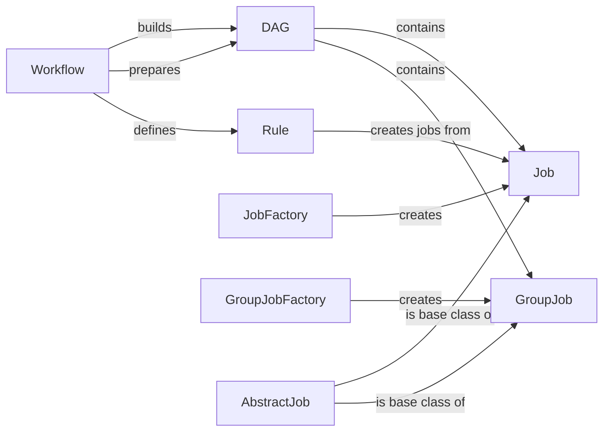

## Component Details

The DAG Construction and Job Management component is responsible for transforming a workflow definition into an executable plan. It parses the workflow, creates a directed acyclic graph (DAG) representing job dependencies, and manages the lifecycle of individual jobs. The workflow defines rules, which are then used to create jobs. The DAG ensures that jobs are executed in the correct order, respecting dependencies. Job factories are used to instantiate jobs and group jobs, optimizing resource allocation and scheduling.

### Workflow
The Workflow class manages the overall workflow definition, including adding rules and constructing the DAG. It orchestrates the creation of the DAG by preparing it with rules and their dependencies.
- **Related Classes/Methods**: `snakemake.src.snakemake.workflow.Workflow`

### DAG
The DAG class represents the directed acyclic graph of jobs. It manages job dependencies, updates job priorities, handles temporary files and protected outputs, and provides methods for traversing and visualizing the graph.
- **Related Classes/Methods**: `snakemake.src.snakemake.dag.DAG`

### Rule
The Rule class represents a single rule in the workflow. It defines the input, output, parameters, and shell command for a job. Rules are added to the Workflow and used to construct the DAG.
- **Related Classes/Methods**: `snakemake.src.snakemake.rules.Rule`

### Job
The Job class represents a single job in the DAG. It encapsulates the execution of a rule with specific input and output files. Jobs are created from Rules and added to the DAG.
- **Related Classes/Methods**: `snakemake.src.snakemake.jobs.Job`

### JobFactory
The JobFactory class is responsible for creating Job instances from Rules. It handles the instantiation of jobs based on the rule definition.
- **Related Classes/Methods**: `snakemake.src.snakemake.jobs.JobFactory`

### GroupJob
The GroupJob class represents a group of jobs that can be executed together. It is used to optimize resource allocation and scheduling.
- **Related Classes/Methods**: `snakemake.src.snakemake.jobs.GroupJob`

### GroupJobFactory
The GroupJobFactory class is responsible for creating GroupJob instances. It handles the instantiation of group jobs based on the rule definition.
- **Related Classes/Methods**: `snakemake.src.snakemake.jobs.GroupJobFactory`

### AbstractJob
The AbstractJob class is an abstract base class for Job and GroupJob. It defines common methods for jobs, such as resource management and product handling.
- **Related Classes/Methods**: `snakemake.src.snakemake.jobs.AbstractJob`
