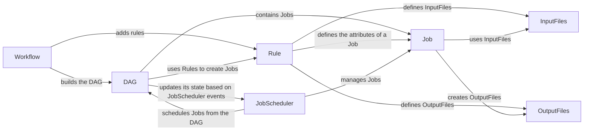

## Component Details

The DAG Construction and Scheduling component is responsible for transforming a parsed workflow definition into an executable plan. It constructs a directed acyclic graph (DAG) representing job dependencies, leveraging rules and their input/output relationships. The DAG is then utilized by the job scheduler to determine the optimal job execution order, considering dependencies, resource requirements, and priorities. This process ensures efficient and correct workflow execution.

### Workflow
The Workflow component manages the overall workflow definition, holding rules and providing the entry point for DAG construction. It's responsible for adding rules and initiating the DAG building process based on these rules.
- **Related Classes/Methods**: `snakemake.src.snakemake.workflow.Workflow`

### Rule
The Rule component defines a single step in the workflow, specifying input, output, parameters, and resource requirements. It encapsulates the logic for expanding wildcards and input functions, providing the blueprint for creating individual jobs.
- **Related Classes/Methods**: `snakemake.src.snakemake.rules.Rule`

### DAG
The DAG component represents the workflow as a directed acyclic graph of jobs and their dependencies. It maintains the workflow's state, updates job dependencies, tracks ready jobs, and manages pipes and services. It provides methods for adding, deleting, and replacing jobs, as well as traversing the graph.
- **Related Classes/Methods**: `snakemake.src.snakemake.dag.DAG`

### Job
The Job component represents a single unit of work to be executed. It encapsulates the rule, input files, output files, and other attributes necessary for execution. It provides methods for accessing resources and scheduler resources.
- **Related Classes/Methods**: `snakemake.src.snakemake.jobs.Job`, `snakemake.src.snakemake.jobs.JobFactory`, `snakemake.src.snakemake.jobs.GroupJob`

### JobScheduler
The JobScheduler component schedules jobs for execution based on dependencies and resource requirements. It maintains a queue of ready jobs, selects jobs to run based on a scheduling algorithm, and handles job completion and errors. It interacts with the DAG to update job states and manage resource allocation.
- **Related Classes/Methods**: `snakemake.src.snakemake.scheduler.JobScheduler`

### InputFiles
The InputFiles component represents the input files required for a job. It handles the expansion of wildcards and input functions to determine the actual input files. It interacts with the Rule and Job components to resolve input file dependencies.
- **Related Classes/Methods**: `snakemake.src.snakemake.io.InputFiles`

### OutputFiles
The OutputFiles component represents the output files generated by a job. It handles the creation of output directories and files. It interacts with the Rule and Job components to define the output files for a job.
- **Related Classes/Methods**: `snakemake.src.snakemake.io.OutputFiles`
