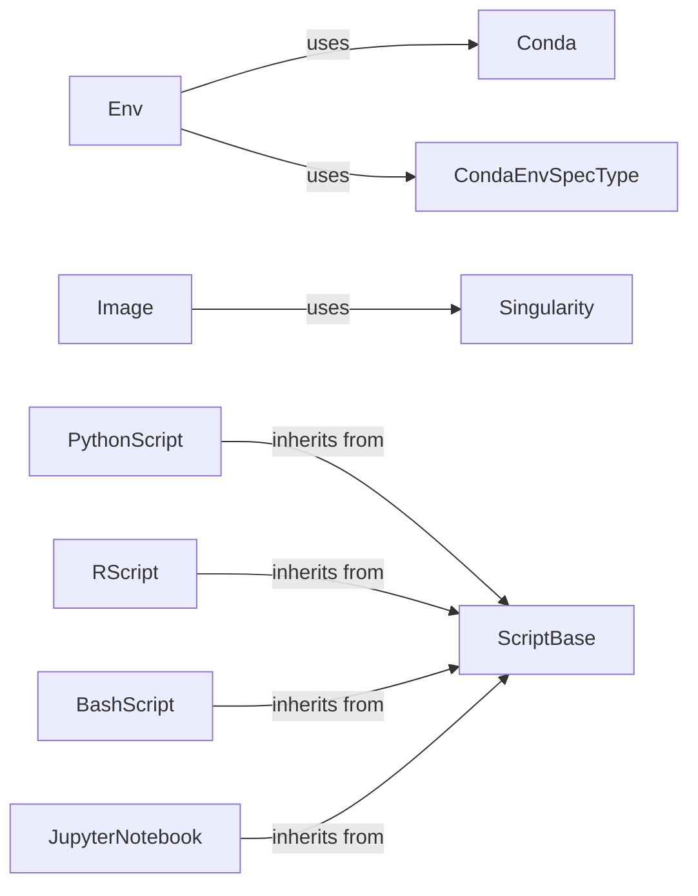

## Component Details

The Environment and Script Management subsystem in Snakemake is responsible for providing isolated and reproducible environments for executing jobs. It leverages Conda and Singularity to manage software dependencies and containerization. The subsystem also handles the execution of scripts written in various languages (Python, R, Bash, etc.) and Jupyter Notebooks, providing a consistent interface for interacting with the Snakemake workflow.

### Env
The `Env` component manages Conda environments for Snakemake rules, ensuring reproducibility by handling environment creation, deployment, and pinning. It interacts with the `Conda` component to execute Conda commands and with `CondaEnvSpecType` to determine the environment specification type.
- **Related Classes/Methods**: `snakemake.src.snakemake.deployment.conda.Env`

### Conda
The `Conda` component provides an interface to Conda for managing software environments. It encapsulates Conda commands and handles version checking and environment activation. It is used by the `Env` component to create and manage Conda environments.
- **Related Classes/Methods**: `snakemake.src.snakemake.deployment.conda.Conda`

### CondaEnvSpecType
The `CondaEnvSpecType` component determines the type of Conda environment specification (file, directory, or name) and creates the appropriate specification object (e.g., `CondaEnvFileSpec`, `CondaEnvDirSpec`, `CondaEnvNameSpec`).
- **Related Classes/Methods**: `snakemake.src.snakemake.deployment.conda.CondaEnvSpecType`

### Image
The `Image` component manages Singularity images for Snakemake rules. It handles image pulling and path resolution. It interacts with the `Singularity` component to execute Singularity commands.
- **Related Classes/Methods**: `snakemake.src.snakemake.deployment.singularity.Image`

### Singularity
The `Singularity` component provides an interface to Singularity for managing containerized environments. It encapsulates Singularity commands and handles version checking. It is used by the `Image` component to manage Singularity images.
- **Related Classes/Methods**: `snakemake.src.snakemake.deployment.singularity`

### ScriptBase
The `ScriptBase` component serves as the base class for all script types (Python, R, Bash, etc.). It defines common methods for evaluating scripts and executing commands. It is inherited by specific script classes like `PythonScript`, `RScript`, and `BashScript`.
- **Related Classes/Methods**: `snakemake.src.snakemake.script.ScriptBase`

### PythonScript
The `PythonScript` component handles the execution of Python scripts within Snakemake rules. It generates a preamble to set up the Python environment and executes the script using the Python interpreter. It inherits from `ScriptBase`.
- **Related Classes/Methods**: `snakemake.src.snakemake.script.PythonScript`

### RScript
The `RScript` component handles the execution of R scripts within Snakemake rules. It generates a preamble to set up the R environment and executes the script using the R interpreter. It inherits from `ScriptBase` and uses `REncoder`.
- **Related Classes/Methods**: `snakemake.src.snakemake.script.RScript`

### BashScript
The `BashScript` component handles the execution of Bash scripts within Snakemake rules. It generates a preamble to set up the Bash environment and executes the script using the Bash interpreter. It inherits from `ScriptBase`.
- **Related Classes/Methods**: `snakemake.src.snakemake.script.BashScript`

### JupyterNotebook
The `JupyterNotebook` component handles the execution of Jupyter Notebooks within Snakemake rules. It converts the notebook to a script and executes it. It inherits from `ScriptBase`.
- **Related Classes/Methods**: `snakemake.src.snakemake.notebook.JupyterNotebook`
