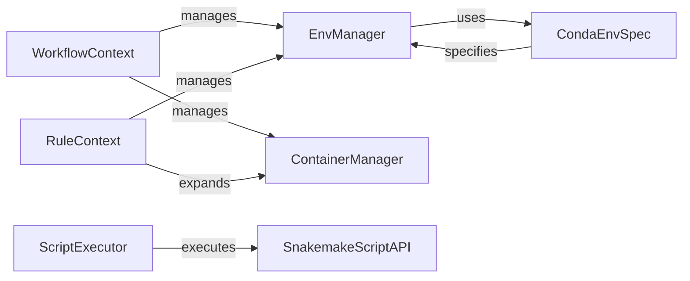

## Component Details

The Environment and Script Management subsystem in Snakemake focuses on providing isolated and reproducible environments for executing jobs, along with the capability to run code specified in rules or external scripts. It leverages Conda for environment management and containerization technologies like Singularity for creating isolated execution environments. The subsystem also handles the execution of various scripting languages, including Python, R, and Bash, within these environments.

### EnvManager
The EnvManager component is responsible for managing the creation, deployment, and handling of isolated environments using Conda. It abstracts the underlying Conda commands and ensures that each job runs in a consistent and reproducible environment. It handles the creation of environment files, deployment scripts, and pinning files. It also calculates hashes for environment content and provides the environment's address.
- **Related Classes/Methods**: `snakemake.src.snakemake.deployment.conda.Env`, `snakemake.src.snakemake.deployment.conda.Conda`

### CondaEnvSpec
The CondaEnvSpec component handles the specification of Conda environments, whether defined in a file, directory, or by name. It parses the specification, applies wildcards, and retrieves the corresponding Conda environment. It determines the type of Conda environment specification from a given spec.
- **Related Classes/Methods**: `snakemake.src.snakemake.deployment.conda.CondaEnvFileSpec`, `snakemake.src.snakemake.deployment.conda.CondaEnvDirSpec`, `snakemake.src.snakemake.deployment.conda.CondaEnvNameSpec`, `snakemake.src.snakemake.deployment.conda.CondaEnvSpecType`

### ContainerManager
The ContainerManager component manages container images using Singularity. It checks for the existence of images, pulls them if necessary, and provides the image path for job execution within a containerized environment.
- **Related Classes/Methods**: `snakemake.src.snakemake.deployment.singularity.Image`, `snakemake.src.snakemake.deployment.singularity.Singularity`

### ScriptExecutor
The ScriptExecutor component handles the execution of scripts written in various languages, including Python, R, and Bash. It generates the necessary preamble, combines it with the script source code, and executes the script within the specified environment.
- **Related Classes/Methods**: `snakemake.src.snakemake.script.PythonScript`, `snakemake.src.snakemake.script.RScript`, `snakemake.src.snakemake.script.BashScript`

### SnakemakeScriptAPI
The SnakemakeScriptAPI component provides access to Snakemake-specific functions within scripts, allowing scripts to interact with the Snakemake workflow and access its features.
- **Related Classes/Methods**: `snakemake.src.snakemake.script.Snakemake`

### WorkflowContext
The WorkflowContext component manages the overall workflow execution, including the management of Conda environments and container images. It provides the context in which rules and scripts are executed.
- **Related Classes/Methods**: `snakemake.src.snakemake.workflow.Workflow`

### RuleContext
The RuleContext component represents a Snakemake rule and handles the expansion of Conda environments and container images specific to that rule. It provides the context in which a rule is executed.
- **Related Classes/Methods**: `snakemake.src.snakemake.rules.Rule`
