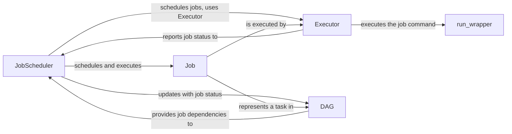

## Component Details

The execution and scheduling component orchestrates the execution of jobs within the Snakemake workflow. It leverages a directed acyclic graph (DAG) to understand job dependencies and schedules jobs for execution based on resource availability and priority. The JobScheduler selects runnable jobs from the DAG, while Executors handle the actual execution of jobs in various environments (local, cluster, cloud). The component ensures that jobs are executed in the correct order, manages resource allocation, and handles job completion or failure, updating the DAG accordingly.

### JobScheduler
The JobScheduler is responsible for selecting and scheduling jobs for execution. It maintains a queue of runnable jobs based on the DAG's dependencies and resource constraints. It prioritizes jobs and interacts with the Executor to execute them. Upon job completion or failure, it updates the DAG accordingly.
- **Related Classes/Methods**: `snakemake.src.snakemake.scheduler.JobScheduler`

### Executor
The Executor is an abstract class that defines the interface for executing individual jobs. Concrete implementations, such as LocalExecutor, ClusterExecutor, and CloudExecutor, handle the specifics of job execution in different environments. The Executor prepares the job environment, runs the job command, and reports job status back to the JobScheduler.
- **Related Classes/Methods**: `snakemake.src.snakemake.executors.Executor`, `snakemake.src.snakemake.executors.local.LocalExecutor`

### DAG
The DAG represents the workflow as a directed acyclic graph of jobs and their dependencies. It provides the JobScheduler with information about job dependencies and is updated by the JobScheduler as jobs are completed or fail. It manages the overall structure of the workflow and the relationships between jobs.
- **Related Classes/Methods**: `snakemake.src.snakemake.dag.DAG`

### Job
The Job class represents a single task or step in the workflow. It contains information about the job's dependencies, input files, output files, shell command, and resource requirements. The JobScheduler uses this information to schedule and execute the job.
- **Related Classes/Methods**: `snakemake.src.snakemake.jobs.Job`

### run_wrapper
The run_wrapper function is responsible for executing the shell command of a job. It sets up the execution environment, captures the output, and handles errors. It is used by the Executor to actually run the job's command.
- **Related Classes/Methods**: `snakemake.src.snakemake.executors.local.run_wrapper`
