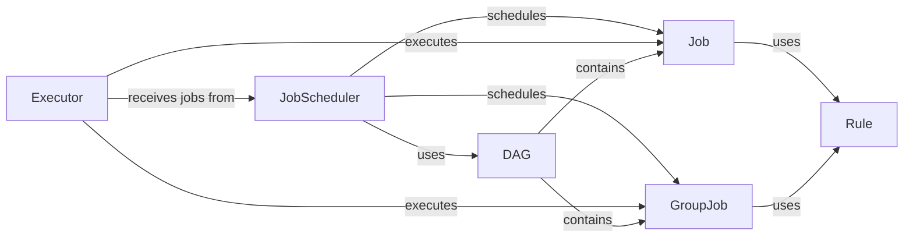

## Component Details

The execution and scheduling component orchestrates the execution of jobs within the Snakemake workflow. It leverages a directed acyclic graph (DAG) to represent job dependencies and schedules jobs for execution based on resource availability and dependencies. The JobScheduler determines the order of execution, while Executors handle the actual execution of jobs, managing their environment and handling callbacks. Jobs and GroupJobs represent individual and grouped tasks, respectively, with Rules defining the execution steps. The component ensures efficient and reliable execution of the workflow by managing job dependencies, resource allocation, and execution processes.

### JobScheduler
The JobScheduler is responsible for scheduling jobs based on the DAG and available resources. It determines the order in which jobs are executed, considering dependencies and resource constraints. It interacts with the DAG to understand job dependencies and with the Executor to execute the jobs.
- **Related Classes/Methods**: `snakemake.src.snakemake.scheduler.JobScheduler`

### Executor
The Executor is responsible for executing jobs. It handles the actual execution of jobs, including preparing the job environment, running the job command, and handling callbacks after job completion. It interacts with the JobScheduler to receive jobs to execute and with the Job class to understand the job's execution requirements.
- **Related Classes/Methods**: `snakemake.src.snakemake.executors.local.Executor`

### Job
The Job class represents a single job to be executed. It contains information about the job's dependencies, resources, and the command to be executed. It is used by the JobScheduler to schedule jobs and by the Executor to execute jobs.
- **Related Classes/Methods**: `snakemake.src.snakemake.jobs.Job`

### GroupJob
The GroupJob class represents a group of jobs to be executed together. It is used to optimize the execution of jobs that share common dependencies or resources. It is managed by the JobScheduler and executed by the Executor.
- **Related Classes/Methods**: `snakemake.src.snakemake.jobs.GroupJob`

### DAG
The DAG (Directed Acyclic Graph) represents the workflow as a graph of jobs and their dependencies. It is used by the JobScheduler to determine the order in which jobs can be executed. It contains Job and GroupJob instances.
- **Related Classes/Methods**: `snakemake.src.snakemake.dag.DAG`

### Rule
The Rule class defines a rule in the Snakemake workflow. It specifies the input files, output files, and the command to be executed for a particular step in the workflow. Jobs and GroupJobs use rules to define their execution.
- **Related Classes/Methods**: `snakemake.src.snakemake.rules.Rule`
