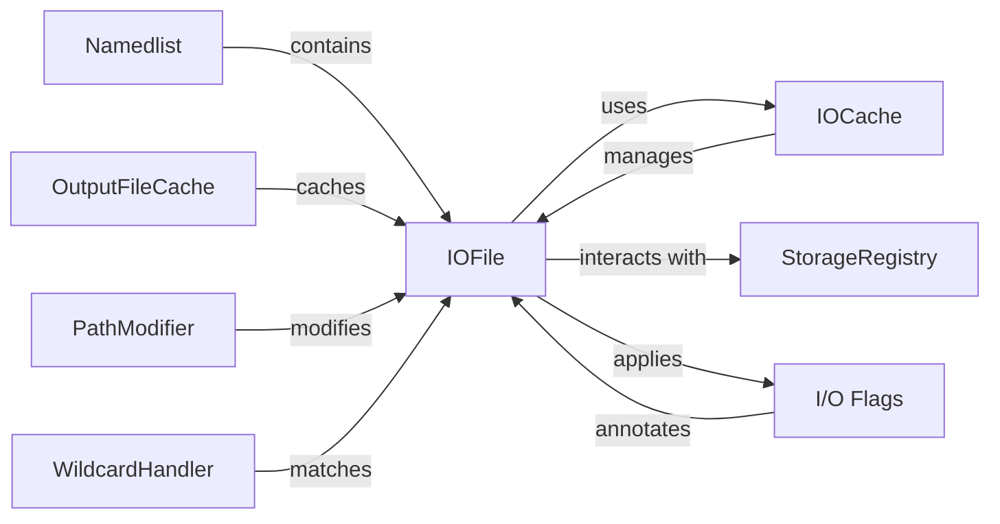

## Component Details

The I/O and Storage Management subsystem in Snakemake is responsible for handling all file-related operations, including input and output file management, caching, and interaction with various storage backends. It ensures data integrity, efficient access, and seamless integration with different storage systems. The core components work together to provide a robust and flexible I/O layer for Snakemake workflows.

### IOFile
The IOFile class represents a file within Snakemake, encapsulating its properties and behavior. It handles file existence checks, modification times, checksums, and interactions with storage backends. IOFile also manages wildcards and their application to filenames, providing a unified interface for file operations.
- **Related Classes/Methods**: `snakemake.src.snakemake.io._IOFile`, `snakemake.src.snakemake.io.IOFile`

### IOCache
The IOCache class manages caching of file metadata, such as modification times and checksums, to improve performance. It provides methods for saving, loading, and deactivating the cache, reducing the need for repeated file system operations.
- **Related Classes/Methods**: `snakemake.src.snakemake.io.IOCache`

### Namedlist
The Namedlist class is a list-like object that allows accessing items by name or index. It's used to manage collections of input and output files, providing convenient access and manipulation within Snakemake workflows.
- **Related Classes/Methods**: `snakemake.src.snakemake.io.Namedlist`

### StorageRegistry
The StorageRegistry class manages different storage backends for input and output files, enabling Snakemake to interact with various storage systems (e.g., local file system, cloud storage) in a unified way. It provides a consistent interface for accessing and storing files regardless of the underlying storage technology.
- **Related Classes/Methods**: `snakemake.src.snakemake.storage.StorageRegistry`

### OutputFileCache
The OutputFileCache (both local and storage implementations) handles caching of output files to avoid recomputation. It provides methods for storing, fetching, and checking the existence of cached output files, significantly improving workflow efficiency.
- **Related Classes/Methods**: `snakemake.src.snakemake.caching.local.OutputFileCache`, `snakemake.src.snakemake.caching.storage.OutputFileCache`

### PathModifier
The PathModifier class modifies file paths based on specified rules, such as replacing prefixes or applying default storage locations. It allows for flexible and configurable path manipulation within Snakemake workflows.
- **Related Classes/Methods**: `snakemake.src.snakemake.path_modifier.PathModifier`

### WildcardHandler
The WildcardHandler classes (including WildcardHandlerBase and QueryWildcardHandler) handle wildcard matching in filenames. They provide the functionality to extract values from filenames based on wildcard patterns, enabling dynamic file selection and processing.
- **Related Classes/Methods**: `snakemake.src.snakemake.ioutils.lookup.WildcardHandlerBase`, `snakemake.src.snakemake.ioutils.lookup.QueryWildcardHandler`

### I/O Flags
I/O Flags annotate I/O files with properties like 'temp', 'protected', etc., influencing how Snakemake handles them. These flags control file deletion, modification permissions, and other aspects of file management.
- **Related Classes/Methods**: `snakemake.src.snakemake.io:flag`, `snakemake.src.snakemake.io:temporary`, `snakemake.src.snakemake.io:protected`, `snakemake.src.snakemake.io:ancient`, `snakemake.src.snakemake.io:directory`, `snakemake.src.snakemake.ioflags`
