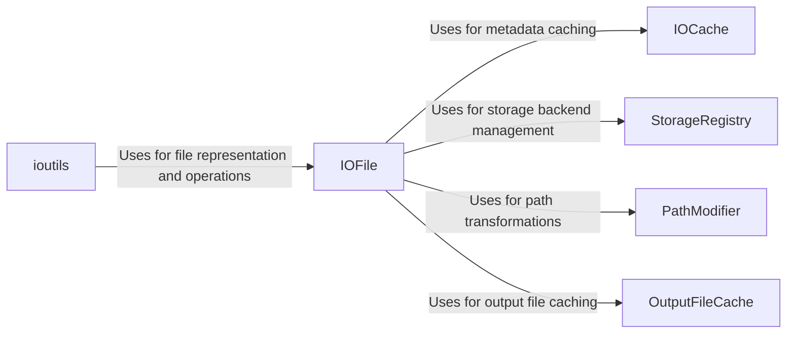

## Component Details

The I/O and Storage Management subsystem in Snakemake is responsible for handling all file-related operations during workflow execution. It manages input and output files, performs file existence checks, expands wildcards, and supports remote files from various sources like S3 and HTTP. The subsystem also provides data integrity verification, caching mechanisms to avoid redundant computations, and storage management for both local and cloud-based solutions. It ensures efficient and reliable access to files throughout the workflow.

### IOFile
Represents a file (input or output) within a Snakemake workflow. It encapsulates file path information and provides methods for interacting with the file system, including checking file existence, retrieving metadata (modification time, size), and performing file operations (copying, removing). It leverages IOCache for metadata caching, StorageRegistry for handling different storage backends, PathModifier for path transformations, and OutputFileCache for caching output file contents.
- **Related Classes/Methods**: `snakemake.src.snakemake.io.IOFile`, `snakemake.src.snakemake.io._IOFile`

### IOCache
Caches file metadata (e.g., modification time, size) to improve workflow execution speed. By storing this information, Snakemake can quickly determine if a file has changed without needing to access the file system directly. It is used by IOFile to retrieve and store cached metadata.
- **Related Classes/Methods**: `snakemake.src.snakemake.io.IOCache`

### StorageRegistry
Manages different storage backends (local disk, cloud storage, remote servers) and provides a unified interface for accessing files regardless of their location. It allows Snakemake to interact with various storage systems in a consistent manner. IOFile uses this registry to handle file access based on the specified storage backend.
- **Related Classes/Methods**: `snakemake.src.snakemake.storage.StorageRegistry`

### OutputFileCache
Caches the contents of output files to avoid recomputing them if they are already available. It stores and retrieves output files from a local or remote cache, reducing execution time. IOFile interacts with this component to store and retrieve cached output files.
- **Related Classes/Methods**: `snakemake.src.snakemake.caching.storage.OutputFileCache`, `snakemake.src.snakemake.caching.local.OutputFileCache`, `snakemake.src.snakemake.caching.AbstractOutputFileCache`

### PathModifier
Modifies file paths based on specified rules, such as replacing prefixes or applying default storage locations. This ensures that files are accessed correctly, especially when dealing with different storage configurations. IOFile uses this component to transform file paths before accessing them.
- **Related Classes/Methods**: `snakemake.src.snakemake.path_modifier.PathModifier`

### ioutils
Provides utility functions for working with input and output files, including checksum calculation, file list flattening, file existence checking, and wildcard-based file lookup. These functions are used throughout the Snakemake workflow to perform common file-related operations. It uses IOFile to perform various file-related operations.
- **Related Classes/Methods**: `snakemake.src.snakemake.ioutils`
