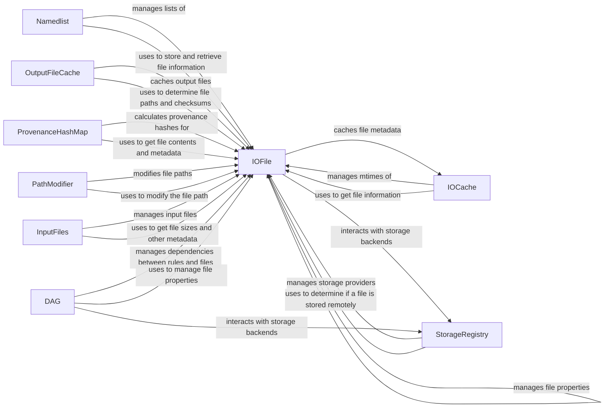

## Component Details

The I/O and Storage Management component in Snakemake handles all aspects of file input, output, and storage interactions within the workflow. It manages file metadata, caching, and interactions with various storage backends, ensuring data integrity and optimizing performance. The core functionality revolves around representing files as IOFile objects, caching file metadata using IOCache, and managing storage interactions through the StorageRegistry. OutputFileCache is used to cache the output files to avoid recomputation. ProvenanceHashMap calculates and stores provenance hashes for files, which are used to determine if a cached output file is still valid. PathModifier modifies file paths based on specified prefixes and default storage configurations. InputFiles manages input files, including determining their sizes. The DAG component manages the dependencies between rules and their input/output files.

### IOFile
The IOFile class represents a file within the snakemake workflow. It handles file properties such as existence, modification time, size, and checksum. It also manages interactions with storage backends, including retrieving and preparing files. It interacts with the IOCache to cache file metadata and with storage objects to manage remote storage.
- **Related Classes/Methods**: `snakemake.src.snakemake.io._IOFile`

### IOCache
The IOCache manages the modification times (mtimes) of input and output files to determine if a rule needs to be re-executed. It stores and retrieves mtime information, and handles deactivation when necessary. It interacts with IOFile to get file information and persists the mtime inventory.
- **Related Classes/Methods**: `snakemake.src.snakemake.io.IOCache`

### Namedlist
The Namedlist class provides a list-like data structure where items can be accessed by name. It is used to manage input and output file lists, allowing access to files by their names within the Snakemake workflow. It interacts with IOFile to store and retrieve file information.
- **Related Classes/Methods**: `snakemake.src.snakemake.io.Namedlist`

### OutputFileCache
The OutputFileCache (both local and storage) handles caching output files to avoid recomputation. It provides methods to store, fetch, and check the existence of cached output files. It interacts with IOFile to determine file paths and checksums, and with the storage backend to manage remote storage.
- **Related Classes/Methods**: `snakemake.src.snakemake.caching.storage.OutputFileCache`, `snakemake.src.snakemake.caching.local.OutputFileCache`, `snakemake.src.snakemake.caching.AbstractOutputFileCache`

### ProvenanceHashMap
The ProvenanceHashMap calculates and stores provenance hashes for files, which are used to determine if a cached output file is still valid. It interacts with IOFile to get file contents and metadata for hash calculation.
- **Related Classes/Methods**: `snakemake.src.snakemake.caching.hash.ProvenanceHashMap`

### StorageRegistry
The StorageRegistry manages the available storage providers and their configurations. It allows Snakemake to interact with different storage backends for input and output files. It interacts with IOFile to determine if a file is stored remotely and to retrieve the appropriate storage object.
- **Related Classes/Methods**: `snakemake.src.snakemake.storage.StorageRegistry`

### PathModifier
The PathModifier modifies file paths based on specified prefixes and default storage configurations. It is used to adapt file paths to different environments or storage locations. It interacts with IOFile to modify the file path before it is used in the workflow.
- **Related Classes/Methods**: `snakemake.src.snakemake.path_modifier.PathModifier`

### InputFiles
The InputFiles class manages input files, including determining their sizes. It interacts with IOFile to get file sizes and other metadata.
- **Related Classes/Methods**: `snakemake.src.snakemake.io.InputFiles`

### DAG
The DAG (Directed Acyclic Graph) component manages the dependencies between rules and their input/output files. It handles the retrieval, updating, and storage of files in storage backends, as well as sanitizing local storage copies. It interacts with IOFile to manage file properties and with the StorageRegistry to interact with storage backends.
- **Related Classes/Methods**: `snakemake.src.snakemake.dag.DAG`
