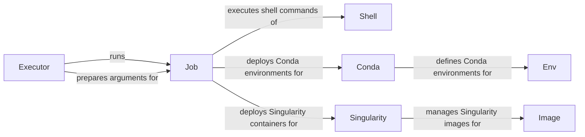

## Component Details

The Job Execution and Environment Management component is responsible for executing individual jobs within a Snakemake workflow. It orchestrates the process of preparing job arguments, managing execution environments (Conda or Singularity), and running the jobs either locally or on a cluster. This component ensures reproducibility and dependency isolation by utilizing Conda environments or containerization technologies. It interacts with various sub-components to handle shell command execution, environment deployment, and resource management.

### Executor
The Executor class manages the execution of jobs, handling tasks such as preparing job arguments, running single or group jobs, and caching or running jobs based on their status. It determines how and where the jobs are executed, interacting with the Job class to obtain job-related information and the Shell class to execute commands.
- **Related Classes/Methods**: `snakemake.src.snakemake.executors.local.Executor:run_job`, `snakemake.src.snakemake.executors.local.Executor:job_args_and_prepare`, `snakemake.src.snakemake.executors.local.Executor:run_single_job`, `snakemake.src.snakemake.executors.local.Executor:run_group_job`, `snakemake.src.snakemake.executors.local.Executor:spawn_job`, `snakemake.src.snakemake.executors.local.Executor:cached_or_run`, `snakemake.src.snakemake.executors.local.Executor:_callback`

### Job
The Job class represents a single job to be executed. It encapsulates information about the job, such as its shell command, input and output files, and resource requirements. It interacts with the Conda and Singularity classes to handle environment deployment, and with the shell module to execute the command. It also manages logging and error handling for the job.
- **Related Classes/Methods**: `snakemake.src.snakemake.jobs.Job:__init__`, `snakemake.src.snakemake.jobs.Job:is_local`, `snakemake.src.snakemake.jobs.Job:shellcmd`, `snakemake.src.snakemake.jobs.Job:prepare`, `snakemake.src.snakemake.jobs.Job:log_info`, `snakemake.src.snakemake.jobs.Job:get_log_error_info`, `snakemake.src.snakemake.jobs.Job:log_error`, `snakemake.src.snakemake.jobs.Job:postprocess`, `snakemake.src.snakemake.jobs.Job:is_pipe`, `snakemake.src.snakemake.jobs.Job:is_service`

### Shell
The shell module provides functions for executing shell commands. It handles tasks such as constructing the command string, setting environment variables, and capturing the output. It is used by the Job class to execute the job's shell command, providing a consistent interface for interacting with the operating system.
- **Related Classes/Methods**: `snakemake.src.snakemake.shell.shell:check_output`, `snakemake.src.snakemake.shell.shell:_get_process_prefix`, `snakemake.src.snakemake.shell.shell:_get_win_command_prefix`, `snakemake.src.snakemake.shell.shell:_check_executable`, `snakemake.src.snakemake.shell.shell:_get_executable_name`, `snakemake.src.snakemake.shell.shell:prefix`, `snakemake.src.snakemake.shell.shell:suffix`, `snakemake.src.snakemake.shell.shell:__new__`

### Conda
The Conda class manages Conda environments for job execution. It handles tasks such as creating, activating, and deactivating Conda environments. It interacts with the Env class to define the environment and with the shell module to execute Conda commands, ensuring that jobs have the correct dependencies.
- **Related Classes/Methods**: `snakemake.src.snakemake.deployment.conda.Conda:__init__`, `snakemake.src.snakemake.deployment.conda.Conda:_get_cmd`, `snakemake.src.snakemake.deployment.conda.Conda:_check`, `snakemake.src.snakemake.deployment.conda.Conda:_check_version`, `snakemake.src.snakemake.deployment.conda.Conda:_check_condarc`, `snakemake.src.snakemake.deployment.conda.Conda:shellcmd`, `snakemake.src.snakemake.deployment.conda.Conda:shellcmd_win`

### Env
The Env class represents a Conda environment. It defines the packages and dependencies required for a job. It interacts with the Conda class to create and manage the environment, providing a declarative way to specify job dependencies.
- **Related Classes/Methods**: `snakemake.src.snakemake.deployment.conda.Env:__init__`, `snakemake.src.snakemake.deployment.conda.Env:conda`, `snakemake.src.snakemake.deployment.conda.Env:pin_file`, `snakemake.src.snakemake.deployment.conda.Env:post_deploy_file`, `snakemake.src.snakemake.deployment.conda.Env:_get_aux_file`, `snakemake.src.snakemake.deployment.conda.Env:_get_content`, `snakemake.src.snakemake.deployment.conda.Env:_get_content_deploy`, `snakemake.src.snakemake.deployment.conda.Env:_get_content_pin`, `snakemake.src.snakemake.deployment.conda.Env:content`, `snakemake.src.snakemake.deployment.conda.Env:content_deploy`, `snakemake.src.snakemake.deployment.conda.Env:content_pin`, `snakemake.src.snakemake.deployment.conda.Env:hash`, `snakemake.src.snakemake.deployment.conda.Env:content_hash`, `snakemake.src.snakemake.deployment.conda.Env:address`, `snakemake.src.snakemake.deployment.conda.Env:create_archive`, `snakemake.src.snakemake.deployment.conda.Env:execute_deployment_script`, `snakemake.src.snakemake.deployment.conda.Env:create`

### Singularity
The Singularity class manages Singularity containers for job execution. It handles tasks such as pulling and running Singularity images. It interacts with the Image class to manage the image and with the shell module to execute Singularity commands, providing a containerized environment for job execution.
- **Related Classes/Methods**: `snakemake.src.snakemake.deployment.singularity:shellcmd`, `snakemake.src.snakemake.deployment.singularity.Singularity:check`

### Image
The Image class represents a Singularity image. It encapsulates information about the image, such as its path and whether it is local. It interacts with the Singularity class to pull and run the image, providing a consistent interface for managing Singularity images.
- **Related Classes/Methods**: `snakemake.src.snakemake.deployment.singularity.Image:__init__`, `snakemake.src.snakemake.deployment.singularity.Image:is_local`, `snakemake.src.snakemake.deployment.singularity.Image:pull`, `snakemake.src.snakemake.deployment.singularity.Image:path`
