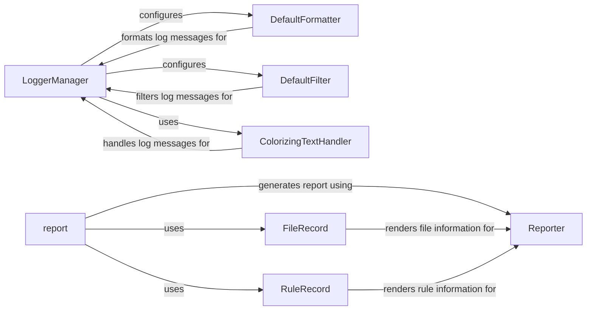

## Component Details

The Reporting and Logging subsystem in Snakemake provides comprehensive feedback and documentation for workflow executions. It encompasses functionalities for setting up logging, formatting log messages, filtering log levels, and generating detailed HTML reports. The logging components ensure that workflow execution is tracked, aiding in debugging and monitoring, while the reporting components summarize workflow progress, including information about rules, input/output files, and performance metrics.

### LoggerManager
The LoggerManager class is responsible for configuring and managing the logging system in Snakemake. It sets up stream and file handlers, applies formatters and filters to log messages, and configures plugin handlers. It ensures that log messages are properly routed and formatted for different output destinations.
- **Related Classes/Methods**: `snakemake.src.snakemake.logging.LoggerManager:setup`, `snakemake.src.snakemake.logging.LoggerManager:_configure_plugin_handler`, `snakemake.src.snakemake.logging.LoggerManager:_default_filter`, `snakemake.src.snakemake.logging.LoggerManager:_default_formatter`, `snakemake.src.snakemake.logging.LoggerManager:_default_filehandler`, `snakemake.src.snakemake.logging.LoggerManager:_default_streamhandler`, `snakemake.src.snakemake.logging.LoggerManager:setup_logfile`

### DefaultFormatter
The DefaultFormatter class formats log messages, including job information, group information, errors, and progress updates. It provides methods to format different types of log records, ensuring that the log messages are informative and easy to understand.
- **Related Classes/Methods**: `snakemake.src.snakemake.logging.DefaultFormatter:format`, `snakemake.src.snakemake.logging.DefaultFormatter:format_job_info`, `snakemake.src.snakemake.logging.DefaultFormatter:format_group_info`, `snakemake.src.snakemake.logging.DefaultFormatter:format_job_error`, `snakemake.src.snakemake.logging.DefaultFormatter:format_group_error`, `snakemake.src.snakemake.logging.DefaultFormatter:format_progress`, `snakemake.src.snakemake.logging.DefaultFormatter:format_job_finished`, `snakemake.src.snakemake.logging.DefaultFormatter:format_dag_debug`, `snakemake.src.snakemake.logging.DefaultFormatter:_format_job_info`, `snakemake.src.snakemake.logging.DefaultFormatter:_format_job_error`, `snakemake.src.snakemake.logging.DefaultFormatter:_format_group_error`

### DefaultFilter
The DefaultFilter class filters log messages based on their level. It determines which messages are passed to the handlers, allowing for control over the verbosity of the logging output.
- **Related Classes/Methods**: `snakemake.src.snakemake.logging.DefaultFilter:filter`

### ColorizingTextHandler
The ColorizingTextHandler class extends the standard logging handler to add color to log messages based on their level. It enhances the readability of log output in the console by visually distinguishing different types of messages.
- **Related Classes/Methods**: `snakemake.src.snakemake.logging.ColorizingTextHandler:__init__`, `snakemake.src.snakemake.logging.ColorizingTextHandler:emit`, `snakemake.src.snakemake.logging.ColorizingTextHandler:decorate`

### report
The `report` function serves as the main entry point for generating Snakemake reports. It orchestrates the rendering of rules, results, and configuration files into a comprehensive HTML report, providing a high-level overview of the workflow execution.
- **Related Classes/Methods**: `snakemake.src.snakemake.report:report`, `snakemake.src.snakemake.report:expand_report_argument`, `snakemake.src.snakemake.report:render_iofile`, `snakemake.src.snakemake.report:expand_labels`, `snakemake.src.snakemake.report:auto_report`

### FileRecord
The FileRecord class represents a file in the report. It handles the rendering of individual files, including their content and metadata, for inclusion in the HTML report.
- **Related Classes/Methods**: `snakemake.src.snakemake.report.FileRecord:__post_init__`, `snakemake.src.snakemake.report.FileRecord:render`

### RuleRecord
The RuleRecord class represents a rule in the report. It stores information about the rule's input, output, and source code, providing a structured representation of the rule for report generation.
- **Related Classes/Methods**: `snakemake.src.snakemake.report.RuleRecord:init_source`, `snakemake.src.snakemake.report.RuleRecord:output`, `snakemake.src.snakemake.report.RuleRecord:input`

### Reporter
The Reporter class (html_reporter.Reporter) is responsible for rendering the complete HTML report. It utilizes data from RuleRecord, FileRecord, and other sources to generate the final report, providing a user-friendly interface for viewing workflow execution details.
- **Related Classes/Methods**: `snakemake.src.snakemake.report.html_reporter.Reporter:render`
