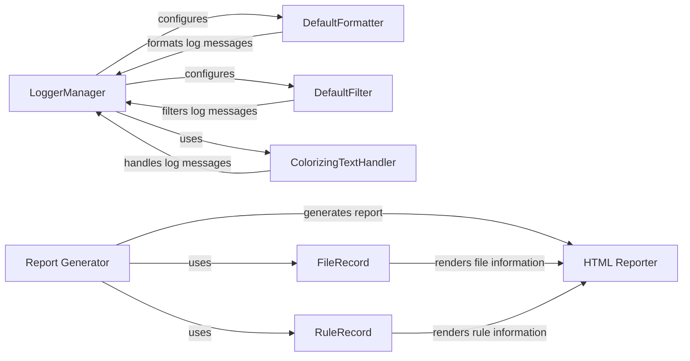

## Component Details

The Reporting and Logging subsystem in Snakemake is responsible for generating comprehensive reports on workflow execution and providing detailed logging for tracking progress and debugging. The logging component offers configurable message formatting, filtering, and colored output, while the reporting component compiles workflow information into an HTML report, including rules, results, and configuration files. These features enable users to effectively monitor, troubleshoot, and document their Snakemake workflows.

### LoggerManager
The LoggerManager class is responsible for setting up and configuring the logging system in Snakemake. It creates and configures handlers (stream and file) and formatters, and applies filters to log messages. It uses a queue listener to handle log messages from different threads.
- **Related Classes/Methods**: `snakemake.src.snakemake.logging.LoggerManager`

### DefaultFormatter
The DefaultFormatter class formats log messages, including job information, group information, errors, and progress updates. It provides methods to format different types of log records and uses helper functions to format job info details, job error details, and group error details.
- **Related Classes/Methods**: `snakemake.src.snakemake.logging.DefaultFormatter`

### DefaultFilter
The DefaultFilter class filters log messages based on their level and other criteria such as dryrun and debug_dag. It determines which messages are passed to the handlers.
- **Related Classes/Methods**: `snakemake.src.snakemake.logging.DefaultFilter`

### ColorizingTextHandler
The ColorizingTextHandler class extends the standard logging handler to add color to log messages based on their level. It enhances the readability of log output in the console. It uses an output lock to prevent garbled output from multiple threads.
- **Related Classes/Methods**: `snakemake.src.snakemake.logging.ColorizingTextHandler`

### Report Generator
The `report` function serves as the main entry point for generating Snakemake reports. It orchestrates the rendering of rules, results, and configuration files into an HTML report, leveraging other components to gather and format the necessary data.
- **Related Classes/Methods**: `snakemake.src.snakemake.report`

### RuleRecord
The RuleRecord class represents a rule in the report. It stores information about the rule's input, output, and source code, providing a structured way to represent rule-specific data for inclusion in the report.
- **Related Classes/Methods**: `snakemake.src.snakemake.report.RuleRecord`

### FileRecord
The FileRecord class represents a file in the report. It handles rendering of individual files and uses data URIs to embed file content in the report, allowing for the inclusion of file contents directly within the HTML report.
- **Related Classes/Methods**: `snakemake.src.snakemake.report.FileRecord`

### HTML Reporter
The Reporter class (html_reporter.Reporter) is responsible for rendering the complete HTML report. It uses data from RuleRecord, FileRecord, and other sources to generate the final report, assembling the various components into a cohesive and informative document.
- **Related Classes/Methods**: `snakemake.src.snakemake.report.html_reporter.Reporter`
