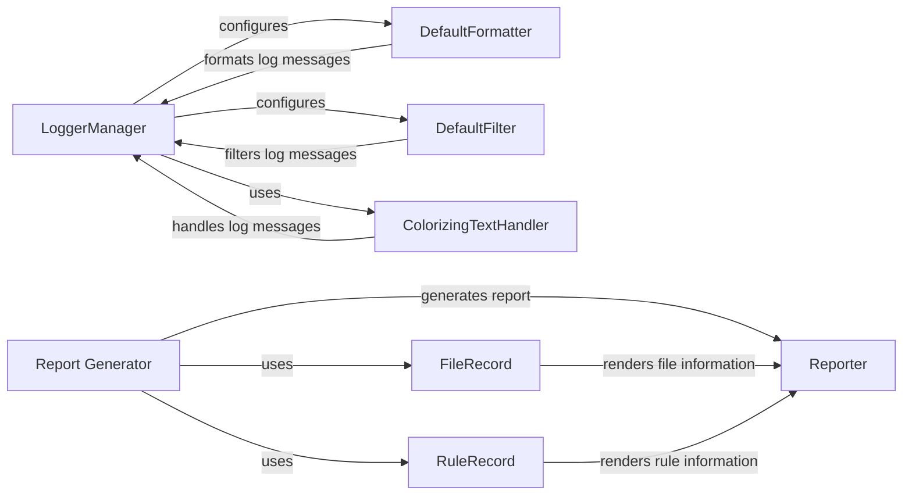

## Component Details

The Reporting and Logging subsystem in Snakemake is responsible for generating comprehensive reports about workflow execution and providing detailed logging for tracking progress and debugging. The logging component offers configurable message formatting, filtering, and colorization, while the reporting component compiles information about rules, input/output files, and performance metrics into an HTML report.

### LoggerManager
The LoggerManager class is responsible for setting up and configuring the logging system in Snakemake. It creates and configures handlers (stream and file) and formatters, and applies filters to log messages to control the verbosity and destination of log output.
- **Related Classes/Methods**: `snakemake.src.snakemake.logging.LoggerManager`

### DefaultFormatter
The DefaultFormatter class formats log messages, including job information, group information, errors, and progress updates. It provides methods to format different types of log records into human-readable strings.
- **Related Classes/Methods**: `snakemake.src.snakemake.logging.DefaultFormatter`

### DefaultFilter
The DefaultFilter class filters log messages based on their level. It determines which messages are passed to the handlers, allowing for control over the amount of detail included in the logs.
- **Related Classes/Methods**: `snakemake.src.snakemake.logging.DefaultFilter`

### ColorizingTextHandler
The ColorizingTextHandler class extends the standard logging handler to add color to log messages based on their level. It enhances the readability of log output in the console by visually distinguishing different types of messages.
- **Related Classes/Methods**: `snakemake.src.snakemake.logging.ColorizingTextHandler`

### Report Generator
The `report` function serves as the main entry point for generating Snakemake reports. It orchestrates the rendering of rules, results, and configuration files into a comprehensive HTML report, providing a high-level overview of the workflow execution.
- **Related Classes/Methods**: `snakemake.src.snakemake.report:report`

### RuleRecord
The RuleRecord class represents a rule in the report. It stores information about the rule's input, output, and source code, facilitating the inclusion of rule-specific details in the generated report.
- **Related Classes/Methods**: `snakemake.src.snakemake.report.RuleRecord`

### FileRecord
The FileRecord class represents a file in the report. It handles rendering of individual files, enabling the inclusion of file-related information in the report.
- **Related Classes/Methods**: `snakemake.src.snakemake.report.FileRecord`

### Reporter
The Reporter class (html_reporter.Reporter) is responsible for rendering the complete HTML report. It uses data from RuleRecord, FileRecord, and other sources to generate the final report, providing a structured and visually appealing representation of the workflow execution.
- **Related Classes/Methods**: `snakemake.src.snakemake.report.html_reporter.Reporter`
