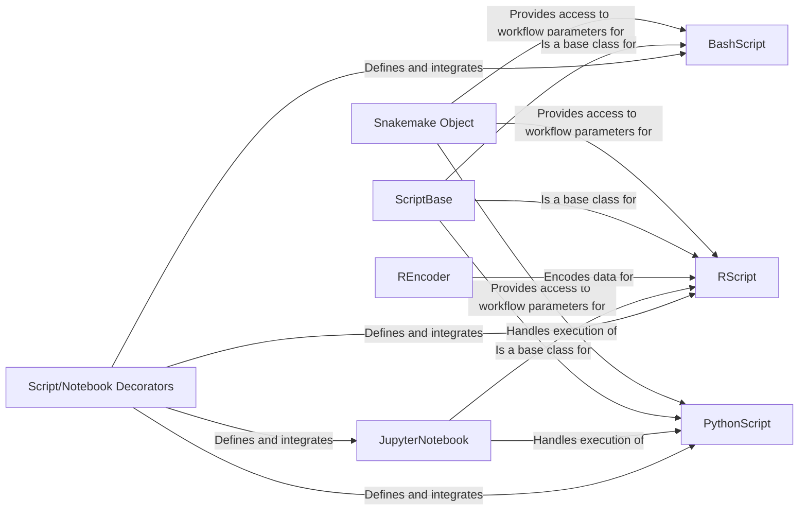

## Component Details

The Script and Notebook Execution component is responsible for executing code embedded within Snakemake workflows, whether it's in the form of scripts (Python, R, Bash, etc.) or Jupyter notebooks. It provides a bridge between the Snakemake workflow and the execution environment of these scripts and notebooks, allowing access to workflow parameters, input/output files, and other relevant information. The component handles the setup and execution of the code, ensuring that the necessary dependencies and environments are in place. It leverages specialized classes for different scripting languages and notebook types, each tailored to the specific requirements of the language or environment.

### Snakemake Object
The Snakemake object provides access to workflow parameters and settings within scripts. It acts as a bridge between the Snakemake workflow and the script execution environment, providing access to input files, output files, parameters, and other workflow-related information.
- **Related Classes/Methods**: `snakemake.src.snakemake.script.Snakemake`

### ScriptBase
ScriptBase serves as the base class for all script execution handlers. It defines the common interface and logic for script execution, including setting up the execution environment and handling errors. It ensures a consistent approach to executing different script types.
- **Related Classes/Methods**: `snakemake.src.snakemake.script.ScriptBase`

### PythonScript
PythonScript handles the execution of Python scripts within Snakemake workflows. It sets up the Python environment, injects the Snakemake object into the script's namespace, and executes the script using the Python interpreter.
- **Related Classes/Methods**: `snakemake.src.snakemake.script.PythonScript`

### RScript
RScript handles the execution of R scripts within Snakemake workflows. It sets up the R environment, encodes data structures for R, and executes the script using the R interpreter.
- **Related Classes/Methods**: `snakemake.src.snakemake.script.RScript`

### BashScript
BashScript handles the execution of Bash scripts within Snakemake workflows. It writes the script to a file and executes it using the Bash interpreter.
- **Related Classes/Methods**: `snakemake.src.snakemake.script.BashScript`

### JupyterNotebook
JupyterNotebook handles the creation, drafting, and execution of Jupyter notebooks. It provides methods for writing scripts to notebook files and executing them using a Jupyter kernel.
- **Related Classes/Methods**: `snakemake.src.snakemake.notebook.JupyterNotebook`

### REncoder
REncoder is responsible for encoding Python data structures into R-compatible representations, enabling seamless data transfer between Python and R scripts within Snakemake workflows.
- **Related Classes/Methods**: `snakemake.src.snakemake.script.REncoder`

### Script/Notebook Decorators
The `script` and `notebook` decorators (or functions) are used to define scripts and notebooks within Snakemake rules. They handle the loading and execution of the script or notebook, integrating it into the workflow.
- **Related Classes/Methods**: `snakemake.src.snakemake.script`, `snakemake.src.snakemake.notebook`
