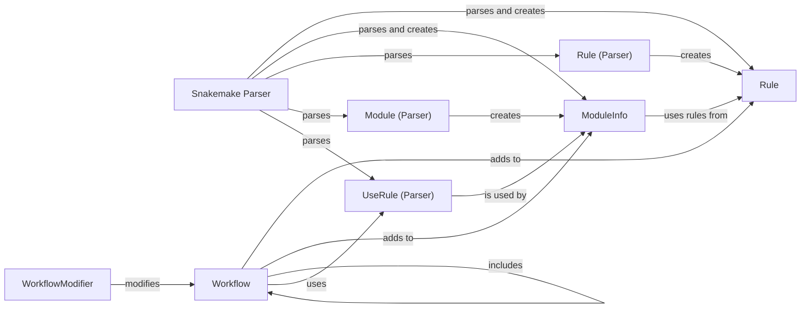

## Component Details

The Workflow Definition and Parsing component is responsible for interpreting the Snakemake DSL and constructing an internal representation of the workflow. It starts by parsing the Snakefile using the `snakemake.parser.parse` function, which transforms the file's content into a series of objects representing rules, modules, and other workflow elements. The `Workflow` class acts as a central registry, holding all rules and modules. Modules can be included to reuse code and simplify workflow organization. The `WorkflowModifier` integrates the modules' functionality into the main workflow. The component uses intermediate parser objects like `snakemake.parser.Rule`, `snakemake.parser.Module`, and `snakemake.parser.UseRule` to represent the parsed content before creating the final workflow objects.

### Snakemake Parser
The Snakemake Parser component is responsible for reading and interpreting the Snakefile. It uses the `parse` function to transform the file content into a series of Rule, Module, and other objects that define the workflow's structure.
- **Related Classes/Methods**: `snakemake.src.snakemake.parser:parse`

### Rule
The Rule component represents a single rule within the Snakemake workflow. It encapsulates information about input files, output files, parameters, shell commands, and other rule-specific settings. It also handles the expansion of input, output, params and log file definitions, allowing for dynamic file name generation.
- **Related Classes/Methods**: `snakemake.src.snakemake.rules.Rule:__init__`, `snakemake.src.snakemake.rules.Rule:set_input`, `snakemake.src.snakemake.rules.Rule:set_output`, `snakemake.src.snakemake.rules.Rule:set_params`, `snakemake.src.snakemake.rules.Rule:set_log`, `snakemake.src.snakemake.rules.Rule:expand_input`, `snakemake.src.snakemake.rules.Rule:expand_params`, `snakemake.src.snakemake.rules.Rule:expand_output`, `snakemake.src.snakemake.rules.Rule:expand_log`

### Workflow
The Workflow component represents the entire Snakemake workflow. It contains a collection of rules and modules, and it manages the execution of the workflow. It also handles includes of other snakemake files, and defines rules, modules and userules. It acts as a central registry for all rules and modules defined in the workflow.
- **Related Classes/Methods**: `snakemake.src.snakemake.workflow.Workflow:__post_init__`, `snakemake.src.snakemake.workflow.Workflow:add_rule`, `snakemake.src.snakemake.workflow.Workflow:include`, `snakemake.src.snakemake.workflow.Workflow:rule`, `snakemake.src.snakemake.workflow.Workflow:module`, `snakemake.src.snakemake.workflow.Workflow:userule`

### ModuleInfo
The ModuleInfo component stores information about a Snakemake module, such as the module's name, the path to its Snakefile, and the rules it exports. It also handles using rules from the module, allowing for modular workflow design and reuse of code.
- **Related Classes/Methods**: `snakemake.src.snakemake.modules.ModuleInfo:__init__`, `snakemake.src.snakemake.modules.ModuleInfo:use_rules`, `snakemake.src.snakemake.modules.ModuleInfo:get_snakefile`

### WorkflowModifier
The WorkflowModifier component is responsible for modifying the main workflow based on the modules that are used. It applies the rules and configuration from the modules to the main workflow, effectively integrating the module's functionality into the main workflow.
- **Related Classes/Methods**: `snakemake.src.snakemake.modules.WorkflowModifier:__init__`

### Rule (Parser)
Represents a rule definition within the parser. It captures the content of a rule block in the snakemake file during the parsing process. This is an intermediate representation used during parsing before a `snakemake.rules.Rule` object is created.
- **Related Classes/Methods**: `snakemake.src.snakemake.parser.Rule:__init__`, `snakemake.src.snakemake.parser.Rule:block_content`

### Module (Parser)
Represents a module definition within the parser. Captures the content of a module block in the snakemake file. This is an intermediate representation used during parsing before a `snakemake.modules.ModuleInfo` object is created.
- **Related Classes/Methods**: `snakemake.src.snakemake.parser.Module:__init__`, `snakemake.src.snakemake.parser.Module:block_content`

### UseRule (Parser)
Represents a 'userule' statement within the parser. Captures the content of a userule block, which allows importing and using rules from modules. This is an intermediate representation used during parsing.
- **Related Classes/Methods**: `snakemake.src.snakemake.parser.UseRule:__init__`, `snakemake.src.snakemake.parser.UseRule:block_content`
