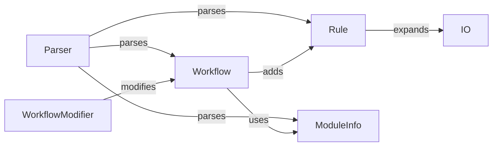

## Component Details

The Workflow Definition and Parsing component is responsible for interpreting the Snakemake workflow definition file (Snakefile). It parses the Snakemake syntax, extracts rules, input/output dependencies, and workflow settings. It manages the modularity of workflows by handling the import of external Snakefiles, enabling code reuse and simplifying complex workflow structures. The central classes involved are `Workflow`, `Rule`, `ModuleInfo`, and the `parse` function, which together define and manage the workflow's structure and behavior.

### Workflow
The Workflow class manages the overall Snakemake workflow. It holds a collection of rules and modules, and provides methods for defining, including, and using them. It also handles workflow-level settings and execution. It interacts with the Rule and ModuleInfo components to manage the workflow's structure.
- **Related Classes/Methods**: `snakemake.src.snakemake.workflow.Workflow`

### Rule
The Rule class represents a single rule within the Snakemake workflow. It stores information about input files, output files, parameters, log files, shell commands, and other rule-specific attributes. It interacts with the Workflow class to be added to the workflow and with the io module to expand filepaths.
- **Related Classes/Methods**: `snakemake.src.snakemake.rules.Rule`

### ModuleInfo
The ModuleInfo class represents a module within the Snakemake workflow. It stores information about the module's name, snakefile, and any rules that are used from the module. It interacts with the Workflow class to be included in the workflow.
- **Related Classes/Methods**: `snakemake.src.snakemake.modules.ModuleInfo`

### Parser
The `parse` function parses a Snakemake workflow definition file (snakefile). It's the entry point for processing the workflow definition and populating the Workflow object with rules and modules. It interacts with the Rule, ModuleInfo, and Workflow classes to create and populate the workflow structure.
- **Related Classes/Methods**: `snakemake.src.snakemake.parser.parse`

### WorkflowModifier
The WorkflowModifier class modifies the workflow based on module usage. It handles tasks such as modifying wrapper URIs. It interacts with the Workflow class to modify its attributes.
- **Related Classes/Methods**: `snakemake.src.snakemake.modules.WorkflowModifier`

### IO
The IO module contains functions for expanding wildcards in file paths and generating file names with multiple extensions. It interacts with the Rule class to expand input and output file paths.
- **Related Classes/Methods**: `snakemake.src.snakemake.io.expand`, `snakemake.src.snakemake.io.multiext`
