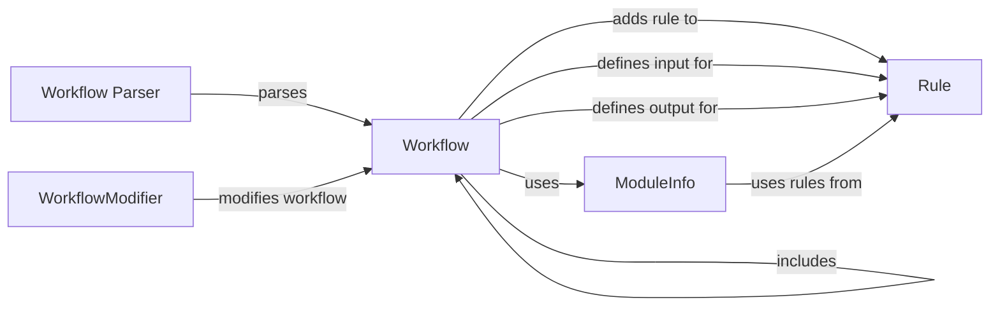

## Component Details

The Workflow Definition and Parsing component is responsible for interpreting the Snakemake workflow definition, typically written in a Snakefile. It parses the Snakefile, extracts rules, input/output dependencies, and workflow configurations. The component utilizes a module system to import external Snakefiles, enabling modular workflow design and component reuse. The parsing process results in a structured representation of the workflow, which is then used for execution.

### Workflow Parser
The Workflow Parser is the entry point for processing the Snakefile. It uses the `parse` function to read and interpret the Snakefile, creating a `Workflow` object that represents the entire workflow structure. It handles the initial parsing and setup of the workflow.
- **Related Classes/Methods**: `snakemake.src.snakemake.parser:parse`

### Workflow
The Workflow component represents the entire Snakemake workflow. It manages a collection of rules, includes other Snakefiles, and defines workflow-level settings. It provides methods for adding rules, including other workflows, and defining input/output file dependencies.
- **Related Classes/Methods**: `snakemake.src.snakemake.workflow.Workflow`

### Rule
The Rule component represents a single rule within the Snakemake workflow. It encapsulates information about the rule's input files, output files, parameters, shell command or Python code to execute, and other configurations such as conda environment and container image. It also handles the expansion of input, output, and parameter definitions.
- **Related Classes/Methods**: `snakemake.src.snakemake.rules.Rule`

### ModuleInfo
The ModuleInfo component represents information about a module included in the workflow. It manages the module's rules, Snakefile location, and wrapper tag. It is used when including external Snakefiles as modules.
- **Related Classes/Methods**: `snakemake.src.snakemake.modules.ModuleInfo`

### WorkflowModifier
The WorkflowModifier component modifies the workflow based on module inclusion. It adjusts settings like wrapper URIs to ensure that the workflow functions correctly with the included modules.
- **Related Classes/Methods**: `snakemake.src.snakemake.modules.WorkflowModifier`
