```mermaid
graph LR
    Workflow_Definition_and_Parsing["Workflow Definition and Parsing"]
    DAG_Construction_and_Job_Management["DAG Construction and Job Management"]
    Execution_and_Scheduling["Execution and Scheduling"]
    I_O_and_Storage_Management["I/O and Storage Management"]
    Environment_and_Script_Management["Environment and Script Management"]
    Reporting_and_Logging["Reporting and Logging"]
    Command_Line_Interface["Command Line Interface"]
    Configuration_Management["Configuration Management"]
    Workflow_Definition_and_Parsing -- "parses" --> Configuration_Management
    DAG_Construction_and_Job_Management -- "builds" --> Workflow_Definition_and_Parsing
    Execution_and_Scheduling -- "schedules" --> DAG_Construction_and_Job_Management
    I_O_and_Storage_Management -- "manages" --> Execution_and_Scheduling
    Environment_and_Script_Management -- "manages" --> Execution_and_Scheduling
    Reporting_and_Logging -- "generates" --> DAG_Construction_and_Job_Management
    Command_Line_Interface -- "uses" --> Workflow_Definition_and_Parsing
    Command_Line_Interface -- "uses" --> Execution_and_Scheduling
    Configuration_Management -- "loads" --> Workflow_Definition_and_Parsing
    Reporting_and_Logging -- "records" --> Execution_and_Scheduling
    I_O_and_Storage_Management -- "stores" --> I_O_and_Storage_Management
    Workflow_Definition_and_Parsing -- "imports" --> Workflow_Definition_and_Parsing
    Environment_and_Script_Management -- "executes" --> Execution_and_Scheduling
    click Workflow_Definition_and_Parsing href "https://github.com/CodeBoarding/GeneratedOnBoardings/blob/main/snakemake/Workflow Definition and Parsing.md" "Details"
    click DAG_Construction_and_Job_Management href "https://github.com/CodeBoarding/GeneratedOnBoardings/blob/main/snakemake/DAG Construction and Job Management.md" "Details"
    click Execution_and_Scheduling href "https://github.com/CodeBoarding/GeneratedOnBoardings/blob/main/snakemake/Execution and Scheduling.md" "Details"
    click I_O_and_Storage_Management href "https://github.com/CodeBoarding/GeneratedOnBoardings/blob/main/snakemake/I/O and Storage Management.md" "Details"
    click Environment_and_Script_Management href "https://github.com/CodeBoarding/GeneratedOnBoardings/blob/main/snakemake/Environment and Script Management.md" "Details"
    click Reporting_and_Logging href "https://github.com/CodeBoarding/GeneratedOnBoardings/blob/main/snakemake/Reporting and Logging.md" "Details"
    click Command_Line_Interface href "https://github.com/CodeBoarding/GeneratedOnBoardings/blob/main/snakemake/Command Line Interface.md" "Details"
    click Configuration_Management href "https://github.com/CodeBoarding/GeneratedOnBoardings/blob/main/snakemake/Configuration Management.md" "Details"
```

## Component Details

Snakemake is a workflow management system that automates the execution of complex data processing pipelines. It uses a declarative workflow definition language based on Python to describe the dependencies between jobs. The core flow involves parsing the workflow definition, constructing a directed acyclic graph (DAG) of jobs, scheduling jobs for execution based on resource availability and dependencies, managing input and output files, and providing a command-line interface for users to interact with the system.

### Workflow Definition and Parsing
This component is responsible for reading and interpreting the Snakefile, the central configuration file that defines the workflow. It parses the Snakemake syntax, extracts rules, input/output dependencies, and workflow settings. It also handles the modularity of workflows by managing the import of external Snakefiles, enabling code reuse and simplifying complex workflow structures.
- **Related Classes/Methods**: `snakemake.src.snakemake.parser`, `snakemake.src.snakemake.rules`, `snakemake.src.snakemake.workflow.Workflow`, `snakemake.src.snakemake.modules`

### DAG Construction and Job Management
This component takes the parsed workflow definition and constructs a Directed Acyclic Graph (DAG) representing the dependencies between jobs. It analyzes the rules and their input/output relationships to create job nodes and edges, ensuring that jobs are executed in the correct order. It also manages the lifecycle of jobs, tracking their status and dependencies.
- **Related Classes/Methods**: `snakemake.src.snakemake.dag.DAG`, `snakemake.src.snakemake.workflow.Workflow`, `snakemake.src.snakemake.jobs`

### Execution and Scheduling
This component is responsible for scheduling the execution of jobs based on the DAG and available resources. It determines the order in which jobs are executed, considering factors such as job dependencies, resource requirements, and priority. It also manages the actual execution of jobs, utilizing different executors for local, cluster, or cloud environments.
- **Related Classes/Methods**: `snakemake.src.snakemake.scheduler.JobScheduler`, `snakemake.src.snakemake.executors`, `snakemake.src.snakemake.executors.local`

### I/O and Storage Management
This component handles the management of input and output files required by the workflow. It performs tasks such as file existence checks, wildcard expansion, and handling of remote files from various storage locations. It also provides features for data integrity verification, caching mechanisms to optimize performance, and storage management to handle large datasets.
- **Related Classes/Methods**: `snakemake.src.snakemake.io`, `snakemake.src.snakemake.ioutils`, `snakemake.src.snakemake.caching`, `snakemake.src.snakemake.storage`

### Environment and Script Management
This component focuses on creating and managing isolated software environments for each job, ensuring reproducibility and dependency isolation. It utilizes tools like Conda or containerization technologies such as Docker or Singularity. Additionally, it handles the execution of code specified within a rule's `run` directive or in separate script files, supporting various scripting languages.
- **Related Classes/Methods**: `snakemake.src.snakemake.deployment.conda`, `snakemake.src.snakemake.deployment.containerize`, `snakemake.src.snakemake.script`, `snakemake.src.snakemake.notebook`

### Reporting and Logging
This component provides essential feedback and documentation for workflow execution. It generates reports summarizing the workflow's progress, including information about rules, input/output files, and performance metrics. It also offers comprehensive logging functionality to track the workflow's execution, aiding in debugging and monitoring.
- **Related Classes/Methods**: `snakemake.src.snakemake.report`, `snakemake.src.snakemake.report.html_reporter`, `snakemake.src.snakemake.logging`

### Command Line Interface
The Command Line Interface (CLI) serves as the primary entry point for users to interact with Snakemake. It parses command-line arguments, allowing users to configure the workflow, specify execution parameters, and initiate the workflow execution process.
- **Related Classes/Methods**: `snakemake.src.snakemake.cli`

### Configuration Management
This component is responsible for loading and managing configuration files, which allow users to define workflow parameters and settings. It provides a flexible way to customize the workflow's behavior without modifying the Snakefile directly.
- **Related Classes/Methods**: `snakemake.src.snakemake.common.configfile`, `snakemake.src.snakemake.settings.types.ConfigSettings`