```mermaid
graph LR
    Workflow_Definition_and_Parsing["Workflow Definition and Parsing"]
    DAG_Construction_and_Scheduling["DAG Construction and Scheduling"]
    Job_Execution_and_Environment_Management["Job Execution and Environment Management"]
    I_O_and_Storage_Management["I/O and Storage Management"]
    Script_and_Notebook_Execution["Script and Notebook Execution"]
    Reporting_and_Logging["Reporting and Logging"]
    Command_Line_Interface["Command Line Interface"]
    Configuration_Management["Configuration Management"]
    Workflow_Definition_and_Parsing -- "parses and defines" --> Configuration_Management
    DAG_Construction_and_Scheduling -- "builds from" --> Workflow_Definition_and_Parsing
    DAG_Construction_and_Scheduling -- "schedules" --> Job_Execution_and_Environment_Management
    Job_Execution_and_Environment_Management -- "executes" --> Script_and_Notebook_Execution
    I_O_and_Storage_Management -- "manages I/O for" --> Job_Execution_and_Environment_Management
    Reporting_and_Logging -- "generates from" --> DAG_Construction_and_Scheduling
    Command_Line_Interface -- "uses" --> Workflow_Definition_and_Parsing
    Command_Line_Interface -- "uses" --> DAG_Construction_and_Scheduling
    Command_Line_Interface -- "uses" --> Job_Execution_and_Environment_Management
    Configuration_Management -- "loads" --> Workflow_Definition_and_Parsing
    Reporting_and_Logging -- "records" --> Job_Execution_and_Environment_Management
    I_O_and_Storage_Management -- "manages storage for" --> I_O_and_Storage_Management
    Workflow_Definition_and_Parsing -- "imports" --> Workflow_Definition_and_Parsing
    Script_and_Notebook_Execution -- "executes in" --> Job_Execution_and_Environment_Management
    click Workflow_Definition_and_Parsing href "https://github.com/CodeBoarding/GeneratedOnBoardings/blob/main/snakemake/Workflow Definition and Parsing.md" "Details"
    click DAG_Construction_and_Scheduling href "https://github.com/CodeBoarding/GeneratedOnBoardings/blob/main/snakemake/DAG Construction and Scheduling.md" "Details"
    click Job_Execution_and_Environment_Management href "https://github.com/CodeBoarding/GeneratedOnBoardings/blob/main/snakemake/Job Execution and Environment Management.md" "Details"
    click I_O_and_Storage_Management href "https://github.com/CodeBoarding/GeneratedOnBoardings/blob/main/snakemake/I/O and Storage Management.md" "Details"
    click Script_and_Notebook_Execution href "https://github.com/CodeBoarding/GeneratedOnBoardings/blob/main/snakemake/Script and Notebook Execution.md" "Details"
    click Reporting_and_Logging href "https://github.com/CodeBoarding/GeneratedOnBoardings/blob/main/snakemake/Reporting and Logging.md" "Details"
    click Command_Line_Interface href "https://github.com/CodeBoarding/GeneratedOnBoardings/blob/main/snakemake/Command Line Interface.md" "Details"
    click Configuration_Management href "https://github.com/CodeBoarding/GeneratedOnBoardings/blob/main/snakemake/Configuration Management.md" "Details"
```

## Component Details

Snakemake is a workflow management system that allows users to define complex data processing pipelines in a human-readable format. The core functionality revolves around parsing a Snakefile, constructing a directed acyclic graph (DAG) of jobs, scheduling those jobs based on dependencies and resource constraints, and executing them using various executors. Input and output files are carefully managed, and isolated environments can be created to ensure reproducibility. The system also provides reporting and logging capabilities to track workflow progress and debug issues.

### Workflow Definition and Parsing
This component is responsible for reading and interpreting the Snakefile, which defines the workflow's structure and rules. It parses the Snakemake syntax, extracts rule definitions, input/output dependencies, and workflow configurations. It also handles the modularity of workflows by managing the import of external Snakefiles, enabling code reuse and simplifying workflow organization.
- **Related Classes/Methods**: `snakemake.src.snakemake.parser`, `snakemake.src.snakemake.rules`, `snakemake.src.snakemake.workflow.Workflow`, `snakemake.src.snakemake.modules`

### DAG Construction and Scheduling
This component takes the parsed workflow definition and constructs a directed acyclic graph (DAG) representing the dependencies between jobs. It analyzes the rules and their input/output relationships to create job nodes and edges in the DAG. The DAG is then used by the job scheduler to determine the optimal order of job execution, considering dependencies, resource requirements, and priorities.
- **Related Classes/Methods**: `snakemake.src.snakemake.dag.DAG`, `snakemake.src.snakemake.workflow.Workflow`, `snakemake.src.snakemake.jobs`, `snakemake.src.snakemake.scheduler.JobScheduler`

### Job Execution and Environment Management
This component is responsible for executing individual jobs within the workflow. It supports various execution environments, including local execution, cluster execution (e.g., SLURM, Grid Engine), and cloud execution. It also manages the execution environment for each job, using Conda or containerization technologies like Docker or Singularity to ensure reproducibility and dependency isolation.
- **Related Classes/Methods**: `snakemake.src.snakemake.executors`, `snakemake.src.snakemake.executors.local`, `snakemake.src.snakemake.shell.shell`, `snakemake.src.snakemake.deployment.conda`, `snakemake.src.snakemake.deployment.containerize`, `snakemake.src.snakemake.deployment.singularity`

### I/O and Storage Management
This component handles the management of input and output files for the workflow. It performs file existence checks, wildcard expansion, and handles remote files from various sources (e.g., S3, HTTP). It also provides features for data integrity verification, caching, and storage management, supporting both local and cloud-based storage solutions.
- **Related Classes/Methods**: `snakemake.src.snakemake.io`, `snakemake.src.snakemake.ioutils`, `snakemake.src.snakemake.caching`, `snakemake.src.snakemake.storage`

### Script and Notebook Execution
This component executes the code specified within a rule's `run` directive or in a separate script file or notebook. It supports various scripting languages, including Python, R, and Bash, and provides a `Snakemake` object that allows access to input files, output files, parameters, and other workflow information within the script or notebook environment.
- **Related Classes/Methods**: `snakemake.src.snakemake.script`, `snakemake.src.snakemake.notebook`

### Reporting and Logging
This component generates reports summarizing the workflow execution, including information about rules, input/output files, and performance metrics. It also provides logging functionality to track the progress of the workflow and debug any issues that may arise during execution.
- **Related Classes/Methods**: `snakemake.src.snakemake.report`, `snakemake.src.snakemake.report.html_reporter`, `snakemake.src.snakemake.logging`

### Command Line Interface
This component provides the entry point for users to interact with Snakemake. It parses command-line arguments, configures the workflow based on those arguments, and initiates the workflow execution process.
- **Related Classes/Methods**: `snakemake.src.snakemake.cli`

### Configuration Management
This component handles the loading and management of configuration files, which allow users to specify workflow parameters and settings. It provides a way to customize the workflow execution without modifying the Snakefile directly.
- **Related Classes/Methods**: `snakemake.src.snakemake.common.configfile`, `snakemake.src.snakemake.settings.types.ConfigSettings`