```mermaid
graph LR
    Workflow_Definition_and_Parsing["Workflow Definition and Parsing"]
    DAG_Construction_and_Job_Management["DAG Construction and Job Management"]
    Execution_and_Scheduling["Execution and Scheduling"]
    I_O_and_Storage_Management["I/O and Storage Management"]
    Environment_and_Script_Management["Environment and Script Management"]
    Reporting_and_Logging["Reporting and Logging"]
    Command_Line_Interface["Command Line Interface"]
    Configuration_Management["Configuration Management"]
    Workflow_Definition_and_Parsing -- "parses" --> Configuration_Management
    DAG_Construction_and_Job_Management -- "builds" --> Workflow_Definition_and_Parsing
    Execution_and_Scheduling -- "schedules" --> DAG_Construction_and_Job_Management
    I_O_and_Storage_Management -- "manages" --> Execution_and_Scheduling
    Environment_and_Script_Management -- "manages" --> Execution_and_Scheduling
    Reporting_and_Logging -- "generates" --> DAG_Construction_and_Job_Management
    Command_Line_Interface -- "uses" --> Workflow_Definition_and_Parsing
    Command_Line_Interface -- "uses" --> Execution_and_Scheduling
    Configuration_Management -- "loads" --> Workflow_Definition_and_Parsing
    Reporting_and_Logging -- "records" --> Execution_and_Scheduling
    I_O_and_Storage_Management -- "stores" --> I_O_and_Storage_Management
    Workflow_Definition_and_Parsing -- "imports" --> Workflow_Definition_and_Parsing
    Environment_and_Script_Management -- "executes" --> Execution_and_Scheduling
    click Workflow_Definition_and_Parsing href "https://github.com/CodeBoarding/GeneratedOnBoardings/blob/main/snakemake/Workflow Definition and Parsing.md" "Details"
    click DAG_Construction_and_Job_Management href "https://github.com/CodeBoarding/GeneratedOnBoardings/blob/main/snakemake/DAG Construction and Job Management.md" "Details"
    click Execution_and_Scheduling href "https://github.com/CodeBoarding/GeneratedOnBoardings/blob/main/snakemake/Execution and Scheduling.md" "Details"
    click I_O_and_Storage_Management href "https://github.com/CodeBoarding/GeneratedOnBoardings/blob/main/snakemake/I/O and Storage Management.md" "Details"
    click Environment_and_Script_Management href "https://github.com/CodeBoarding/GeneratedOnBoardings/blob/main/snakemake/Environment and Script Management.md" "Details"
    click Reporting_and_Logging href "https://github.com/CodeBoarding/GeneratedOnBoardings/blob/main/snakemake/Reporting and Logging.md" "Details"
    click Command_Line_Interface href "https://github.com/CodeBoarding/GeneratedOnBoardings/blob/main/snakemake/Command Line Interface.md" "Details"
    click Configuration_Management href "https://github.com/CodeBoarding/GeneratedOnBoardings/blob/main/snakemake/Configuration Management.md" "Details"
```

## Component Details

Snakemake is a workflow management system that automates the execution of complex data analysis pipelines. It uses a declarative workflow definition language based on Python to describe the dependencies between jobs. The core flow involves parsing the workflow definition, constructing a directed acyclic graph (DAG) of jobs, scheduling jobs for execution based on resource availability and dependencies, managing input and output files, and providing mechanisms for environment and script management. Snakemake also offers reporting and logging capabilities to track workflow progress and debug issues.

### Workflow Definition and Parsing
This component is responsible for parsing the Snakefile, which defines the workflow. It interprets the syntax and semantics of the Snakemake language, extracting rules, input/output dependencies, and other workflow configurations. It uses the module system to import external Snakefiles, allowing for modular workflow design and reuse of components.
- **Related Classes/Methods**: `snakemake.src.snakemake.parser`, `snakemake.src.snakemake.rules`, `snakemake.src.snakemake.workflow.Workflow`, `snakemake.src.snakemake.modules`

### DAG Construction and Job Management
This component constructs the Directed Acyclic Graph (DAG) representing the workflow's job dependencies. It analyzes the rules defined in the Snakefile and creates job nodes based on input and output file relationships. It also manages the jobs and their dependencies, ensuring that jobs are executed in the correct order and that dependencies are satisfied.
- **Related Classes/Methods**: `snakemake.src.snakemake.dag.DAG`, `snakemake.src.snakemake.workflow.Workflow`, `snakemake.src.snakemake.jobs`

### Execution and Scheduling
This component schedules the execution of jobs based on the DAG and available resources. It determines the order in which jobs are executed, considering factors such as job dependencies, resource requirements, and priority. It also handles the actual execution of jobs using different executors, such as local execution or cluster execution.
- **Related Classes/Methods**: `snakemake.src.snakemake.scheduler.JobScheduler`, `snakemake.src.snakemake.executors`, `snakemake.src.snakemake.executors.local`

### I/O and Storage Management
This component manages input and output files, including file existence checks, wildcard expansion, and handling of remote files. It also provides features for data integrity verification, caching, and storage management, ensuring that data is accessed and stored efficiently and reliably.
- **Related Classes/Methods**: `snakemake.src.snakemake.io`, `snakemake.src.snakemake.ioutils`, `snakemake.src.snakemake.caching`, `snakemake.src.snakemake.storage`

### Environment and Script Management
This component handles the creation and management of isolated software environments for each job, typically using Conda or containerization technologies. It also executes the code specified within a rule's `run` directive or in a separate script file, providing a consistent and reproducible environment for each job.
- **Related Classes/Methods**: `snakemake.src.snakemake.deployment.conda`, `snakemake.src.snakemake.deployment.containerize`, `snakemake.src.snakemake.script`, `snakemake.src.snakemake.notebook`

### Reporting and Logging
This component generates reports summarizing the workflow execution, including information about rules, input/output files, and performance metrics. It also provides logging functionality for tracking the progress of the workflow and debugging any issues, allowing users to monitor and troubleshoot their workflows effectively.
- **Related Classes/Methods**: `snakemake.src.snakemake.report`, `snakemake.src.snakemake.report.html_reporter`, `snakemake.src.snakemake.logging`

### Command Line Interface
The CLI provides the entry point for users to interact with Snakemake. It parses command-line arguments, configures the workflow, and initiates execution, providing a user-friendly interface for managing and running Snakemake workflows.
- **Related Classes/Methods**: `snakemake.src.snakemake.cli`

### Configuration Management
This component handles the loading and management of configuration files, which allow users to specify workflow parameters and settings. It provides a flexible way to customize workflow behavior without modifying the Snakefile directly.
- **Related Classes/Methods**: `snakemake.src.snakemake.common.configfile`, `snakemake.src.snakemake.settings.types.ConfigSettings`