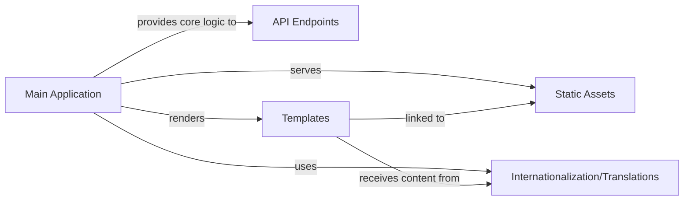

## Details

Abstract Components Overview for snappass project

### Main Application
This is the central orchestrator of the `snappass` web application. It acts as the primary Flask application instance, handling URL routing, processing incoming HTTP requests, and coordinating interactions between other components. It encapsulates the core business logic for managing ephemeral passwords, including encryption, decryption, and interaction with the Redis storage. It also renders HTML templates and serves static assets.

**Related Classes/Methods**:

- <a href="https://github.com/pinterest/snappass/blob/master/snappass/main.py#L355-L357" target="_blank" rel="noopener noreferrer">`snappass.main` (355:357)</a>

### API Endpoints [[Expand]](./API_Endpoints.md)
This component exposes RESTful API interfaces for programmatic interaction with the ephemeral password service. It handles JSON request parsing, input validation (e.g., password strength, TTL), and constructs structured JSON responses, including error details. It leverages the core logic within the "Main Application" component to perform password-related operations.

**Related Classes/Methods**:

- <a href="https://github.com/pinterest/snappass/blob/master/snappass/main.py#L242-L251" target="_blank" rel="noopener noreferrer">`snappass.main:api_handle_password` (242:251)</a>
- <a href="https://github.com/pinterest/snappass/blob/master/snappass/main.py#L255-L298" target="_blank" rel="noopener noreferrer">`snappass.main:api_v2_set_password` (255:298)</a>
- <a href="https://github.com/pinterest/snappass/blob/master/snappass/main.py#L302-L309" target="_blank" rel="noopener noreferrer">`snappass.main:api_v2_check_password` (302:309)</a>
- <a href="https://github.com/pinterest/snappass/blob/master/snappass/main.py#L313-L326" target="_blank" rel="noopener noreferrer">`snappass.main:api_v2_retrieve_password` (313:326)</a>

### Templates
This component comprises the Jinja2 HTML templates responsible for rendering the user interface. They represent the "View" in the Model-View-Template (MVT) pattern, dynamically displaying data provided by the "Main Application" component. These templates define the structure and presentation of the web pages.

**Related Classes/Methods**:

- `snappass.templates.base.html` (1:1)
- `snappass.templates.confirm.html` (1:1)
- `snappass.templates.password.html` (1:1)
- `snappass.templates.preview.html` (1:1)
- `snappass.templates.set_password.html` (1:1)
- `snappass.templates.expired.html` (1:1)

### Static Assets
This component includes client-side resources such as CSS stylesheets for visual presentation, JavaScript files for interactive elements (e.g., clipboard functionality, password preview), and fonts. These assets are served directly by the web server and are crucial for the user experience and visual design of the application.

**Related Classes/Methods**:

- `snappass.static` (1:1)

### Internationalization/Translations
This component manages multi-language support for the application. It provides the mechanisms and data (translation files) to display the user interface in different languages, enhancing accessibility and usability for a global audience.

**Related Classes/Methods**:

- `snappass.translations` (1:1)

### [FAQ](https://github.com/CodeBoarding/GeneratedOnBoardings/tree/main?tab=readme-ov-file#faq)