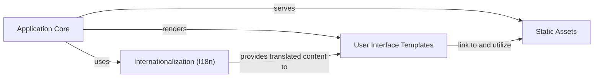

## Details

The `snappass` package does not contain any classes, which is unusual for a Python application. This suggests that the application's logic is primarily implemented using functions and module-level code, rather than an object-oriented approach with classes. This is common in smaller Flask applications where a more procedural style might be adopted. Given this, I will proceed with defining the components based on the file structure and the functional responsibilities identified in the initial analysis, focusing on modules and their interactions rather than class hierarchies.

### Application Core [[Expand]](./Application_Core.md)
This is the heart of the `snappass` application. It's responsible for initializing the Flask application, defining URL routes, handling request processing, managing cryptographic operations (encryption/decryption), and interacting with the Redis store for ephemeral secret management. It acts as the central orchestrator, directing incoming requests to the appropriate logic and rendering responses.

**Related Classes/Methods**:

- <a href="https://github.com/pinterest/snappass/blob/master/snappass/main.py#L355-L357" target="_blank" rel="noopener noreferrer">`snappass.main` (355:357)</a>

### User Interface Templates
This component consists of Jinja2 HTML templates that define the structure and presentation of the web pages. They are the "View" in the Model-View-Template (MVT) pattern, responsible for rendering data provided by the `Application Core` and capturing user input through forms.

**Related Classes/Methods**:

- `snappass.templates.base` (1:1000)
- `snappass.templates.confirm` (1:1000)
- `snappass.templates.password` (1:1000)
- `snappass.templates.preview` (1:1000)
- `snappass.templates.set_password` (1:1000)
- `snappass.templates.expired` (1:1000)

### Static Assets
This component provides client-side resources such as CSS for styling, JavaScript for interactive elements (e.g., clipboard functionality, password preview), and fonts. These assets are served directly by the web server to the client's browser, enhancing the user experience.

**Related Classes/Methods**:

- `snappass.static.bootstrap` (1:1000)
- `snappass.static.clipboardjs` (1:1000)
- `snappass.static.fontawesome` (1:1000)
- `snappass.static.jquery` (1:1000)
- `snappass.static.snappass.css.custom` (1:1000)
- `snappass.static.snappass.scripts.clipboard_button` (1:1000)
- `snappass.static.snappass.scripts.preview` (1:1000)

### Internationalization (I18n)
This component manages multi-language support for the application. It includes message catalogs for various locales, allowing the user interface to be displayed in different languages based on user preferences.

**Related Classes/Methods**:

- `snappass.translations.messages` (1:1000)
- `snappass.translations.en.LC_MESSAGES.messages_mo` (1:1000)
- `snappass.translations.en.LC_MESSAGES.messages_po` (1:1000)

### [FAQ](https://github.com/CodeBoarding/GeneratedOnBoardings/tree/main?tab=readme-ov-file#faq)