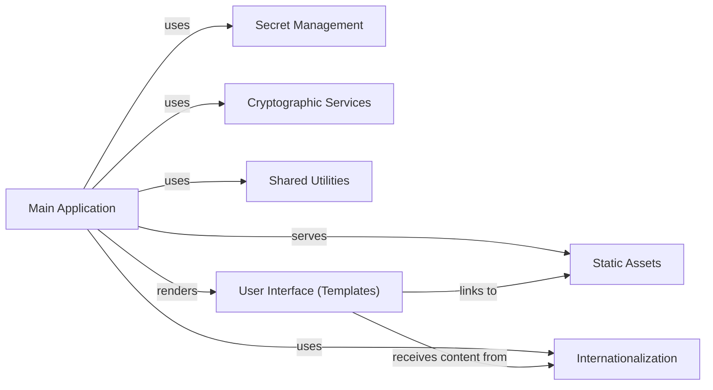

## Details

One paragraph explaining the functionality which is represented by this graph. What the main flow is and what is its purpose.

### Main Application
The central orchestrator of the Flask application, handling routing, request processing, and integrating various functionalities. It manages the overall flow, dispatches requests to appropriate handlers, and coordinates interactions between other components.

**Related Classes/Methods**:

- <a href="https://github.com/pinterest/snappass/blob/master/snappass/main.py#L355-L357" target="_blank" rel="noopener noreferrer">`snappass.main` (355:357)</a>

### Secret Management
Responsible for the secure storage, retrieval, and management of ephemeral secrets using Redis. This includes setting Time-To-Live (TTL) for secrets and handling their one-time retrieval.

**Related Classes/Methods**:

- <a href="https://github.com/pinterest/snappass/blob/master/snappass/main.py#L138-L150" target="_blank" rel="noopener noreferrer">`snappass.main:set_password` (138:150)</a>
- <a href="https://github.com/pinterest/snappass/blob/master/snappass/main.py#L154-L170" target="_blank" rel="noopener noreferrer">`snappass.main:get_password` (154:170)</a>

### Cryptographic Services
Provides functionalities for encrypting and decrypting secrets, ensuring data confidentiality during storage and transmission.

**Related Classes/Methods**:

- <a href="https://github.com/pinterest/snappass/blob/master/snappass/main.py#L74-L82" target="_blank" rel="noopener noreferrer">`snappass.main:encrypt` (74:82)</a>
- <a href="https://github.com/pinterest/snappass/blob/master/snappass/main.py#L85-L91" target="_blank" rel="noopener noreferrer">`snappass.main:decrypt` (85:91)</a>

### Shared Utilities [[Expand]](./Shared_Utilities.md)
A collection of common helper functions and utilities used across various parts of the application. This includes input validation, standardized error response formatting, dynamic URL generation, and token extraction, promoting code reusability and consistency.

**Related Classes/Methods**:

- <a href="https://github.com/pinterest/snappass/blob/master/snappass/main.py#L94-L103" target="_blank" rel="noopener noreferrer">`snappass.main:parse_token` (94:103)</a>
- <a href="https://github.com/pinterest/snappass/blob/master/snappass/main.py#L106-L114" target="_blank" rel="noopener noreferrer">`snappass.main:as_validation_problem` (106:114)</a>
- <a href="https://github.com/pinterest/snappass/blob/master/snappass/main.py#L117-L125" target="_blank" rel="noopener noreferrer">`snappass.main:as_not_found_problem` (117:125)</a>
- <a href="https://github.com/pinterest/snappass/blob/master/snappass/main.py#L128-L134" target="_blank" rel="noopener noreferrer">`snappass.main:as_problem_response` (128:134)</a>
- <a href="https://github.com/pinterest/snappass/blob/master/snappass/main.py#L179-L181" target="_blank" rel="noopener noreferrer">`snappass.main:empty` (179:181)</a>
- <a href="https://github.com/pinterest/snappass/blob/master/snappass/main.py#L184-L199" target="_blank" rel="noopener noreferrer">`snappass.main:clean_input` (184:199)</a>
- <a href="https://github.com/pinterest/snappass/blob/master/snappass/main.py#L202-L215" target="_blank" rel="noopener noreferrer">`snappass.main:set_base_url` (202:215)</a>

### User Interface (Templates)
Comprises Jinja2 HTML files that define the user interface, responsible for presenting data processed by the application to the user.

**Related Classes/Methods**:

- `snappass.templates` (1:2)

### Static Assets
Provides client-side resources such as CSS for styling, JavaScript for dynamic behaviors, and fonts, essential for the application's presentation and interactivity.

**Related Classes/Methods**:

- `snappass.static` (1:2)

### Internationalization
Manages multi-language support, enabling the application's user interface to be displayed in various languages.

**Related Classes/Methods**:

- `snappass.translations` (1:2)

### [FAQ](https://github.com/CodeBoarding/GeneratedOnBoardings/tree/main?tab=readme-ov-file#faq)