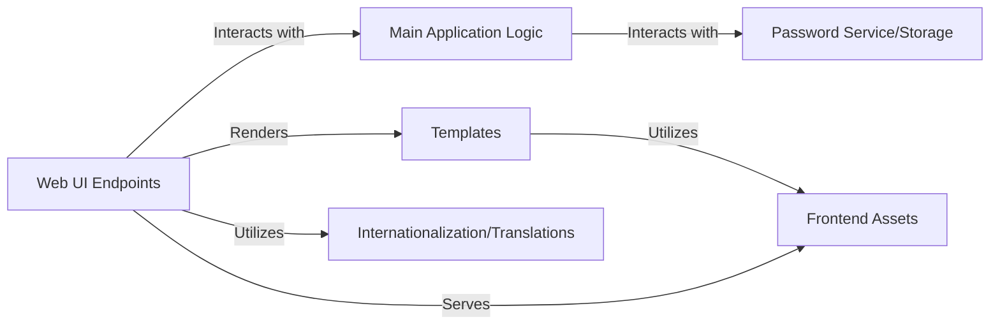

## Details

One paragraph explaining the functionality which is represented by this graph. What the main flow is and what is its purpose.

### Web UI Endpoints [[Expand]](./Web_UI_Endpoints.md)
Manages the user-facing web interface and API endpoints, handling HTTP requests for various HTML pages (e.g., set password form, preview, show password) and API interactions. It processes form submissions, orchestrates interactions with the `Main Application Logic`, and dynamically renders `Templates` to display information to the user or return JSON responses for API calls. It acts as the "Controller" in the MVT pattern.

**Related Classes/Methods**:

- <a href="https://github.com/pinterest/snappass/blob/master/snappass/main.py#L219-L220" target="_blank" rel="noopener noreferrer">`snappass.main.index` (219:220)</a>
- <a href="https://github.com/pinterest/snappass/blob/master/snappass/main.py#L210-L214" target="_blank" rel="noopener noreferrer">`snappass.main.set_password_form` (210:214)</a>
- <a href="https://github.com/pinterest/snappass/blob/master/snappass/main.py#L224-L238" target="_blank" rel="noopener noreferrer">`snappass.main.handle_password` (224:238)</a>
- <a href="https://github.com/pinterest/snappass/blob/master/snappass/main.py#L250-L286" target="_blank" rel="noopener noreferrer">`snappass.main.api_set_password` (250:286)</a>
- <a href="https://github.com/pinterest/snappass/blob/master/snappass/main.py#L290-L306" target="_blank" rel="noopener noreferrer">`snappass.main.api_get_password` (290:306)</a>
- <a href="https://github.com/pinterest/snappass/blob/master/snappass/main.py#L310-L326" target="_blank" rel="noopener noreferrer">`snappass.main.api_check_password` (310:326)</a>
- <a href="https://github.com/pinterest/snappass/blob/master/snappass/main.py#L330-L335" target="_blank" rel="noopener noreferrer">`snappass.main.preview_password` (330:335)</a>
- <a href="https://github.com/pinterest/snappass/blob/master/snappass/main.py#L339-L345" target="_blank" rel="noopener noreferrer">`snappass.main.show_password` (339:345)</a>

### Main Application Logic
Encapsulates the core business logic of the application, including password encryption, decryption, token parsing, and the overall flow of creating, retrieving, and checking password existence. It acts as an intermediary, coordinating between the `Web UI Endpoints` and the `Password Service/Storage`.

**Related Classes/Methods**:

- <a href="https://github.com/pinterest/snappass/blob/master/snappass/main.py#L74-L82" target="_blank" rel="noopener noreferrer">`snappass.main.encrypt` (74:82)</a>
- <a href="https://github.com/pinterest/snappass/blob/master/snappass/main.py#L85-L91" target="_blank" rel="noopener noreferrer">`snappass.main.decrypt` (85:91)</a>
- <a href="https://github.com/pinterest/snappass/blob/master/snappass/main.py#L94-L103" target="_blank" rel="noopener noreferrer">`snappass.main.parse_token` (94:103)</a>
- <a href="https://github.com/pinterest/snappass/blob/master/snappass/main.py#L138-L150" target="_blank" rel="noopener noreferrer">`snappass.main.set_password` (138:150)</a>
- <a href="https://github.com/pinterest/snappass/blob/master/snappass/main.py#L154-L170" target="_blank" rel="noopener noreferrer">`snappass.main.get_password` (154:170)</a>
- <a href="https://github.com/pinterest/snappass/blob/master/snappass/main.py#L174-L176" target="_blank" rel="noopener noreferrer">`snappass.main.password_exists` (174:176)</a>

### Password Service/Storage
Provides an interface for securely storing and retrieving ephemeral passwords using Redis. It abstracts the underlying storage mechanism and handles operations like setting, getting, and checking the existence of passwords, ensuring data integrity and security. It also includes a mechanism to check Redis connectivity.

**Related Classes/Methods**:

- <a href="https://github.com/pinterest/snappass/blob/master/snappass/main.py#L39-L50" target="_blank" rel="noopener noreferrer">`snappass.main.redis_client` (39:50)</a>
- <a href="https://github.com/pinterest/snappass/blob/master/snappass/main.py#L138-L150" target="_blank" rel="noopener noreferrer">`snappass.main.set_password` (138:150)</a>
- <a href="https://github.com/pinterest/snappass/blob/master/snappass/main.py#L154-L170" target="_blank" rel="noopener noreferrer">`snappass.main.get_password` (154:170)</a>
- <a href="https://github.com/pinterest/snappass/blob/master/snappass/main.py#L174-L176" target="_blank" rel="noopener noreferrer">`snappass.main.password_exists` (174:176)</a>
- <a href="https://github.com/pinterest/snappass/blob/master/snappass/main.py#L58-L71" target="_blank" rel="noopener noreferrer">`snappass.main.check_redis_alive` (58:71)</a>

### Frontend Assets
Contains all static files (CSS, JavaScript, images, fonts) required for the client-side rendering and interactivity of the web interface. These assets are served directly to the user's browser to build the visual and interactive elements of the UI.

**Related Classes/Methods**: _None_

### Templates
Consists of Jinja2 HTML templates that define the structure and layout of the web pages displayed to the user. These templates are dynamically populated with data by the `Web UI Endpoints` and `Main Application Logic` to render the final HTML.

**Related Classes/Methods**: _None_

### Internationalization/Translations
Manages the localization of the application's text content, providing support for multiple languages. It allows the application to display messages and labels in the user's preferred language, enhancing accessibility. This component leverages Flask-Babel for translation services.

**Related Classes/Methods**:

- <a href="https://github.com/pinterest/snappass/blob/master/snappass/main.py#L36-L36" target="_blank" rel="noopener noreferrer">`snappass.main.babel` (36:36)</a>
- <a href="https://github.com/pinterest/snappass/blob/master/snappass/main.py#L31-L32" target="_blank" rel="noopener noreferrer">`snappass.main.get_locale` (31:32)</a>

### [FAQ](https://github.com/CodeBoarding/GeneratedOnBoardings/tree/main?tab=readme-ov-file#faq)