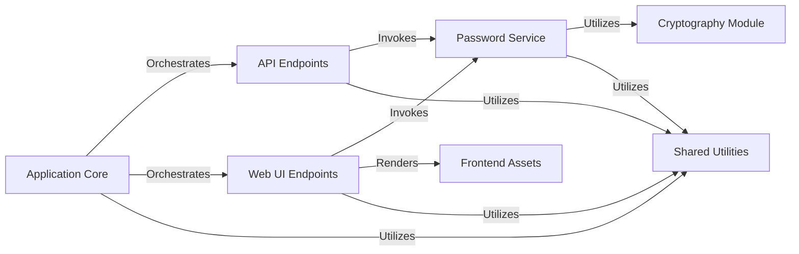

## Details

The `snappass` project is a Flask-based web application designed for secure, ephemeral secret sharing. Users can set a password or secret via a web interface or API, which is then encrypted and stored temporarily. A unique URL is generated for retrieval. Upon the first access, the secret is decrypted and displayed, after which it is immediately and permanently deleted, ensuring its ephemeral nature. The application provides both a user-friendly web interface and a programmatic API for interaction.

### Application Core [[Expand]](./Application_Core.md)
The central module responsible for initializing the Flask application, configuring global settings, and defining the main URL routes. It acts as the primary orchestrator, directing incoming requests to the appropriate handling layers.

**Related Classes/Methods**:

- <a href="https://github.com/pinterest/snappass/blob/master/snappass/main.py#L355-L357" target="_blank" rel="noopener noreferrer">`snappass.main` (355:357)</a>

### API Endpoints [[Expand]](./API_Endpoints.md)
Handles all RESTful API requests for setting, checking, and retrieving ephemeral passwords. It processes JSON payloads, interacts with the `Password Service` for business logic, and returns structured JSON responses, including error handling.

**Related Classes/Methods**:

- <a href="https://github.com/pinterest/snappass/blob/master/snappass/main.py#L242-L251" target="_blank" rel="noopener noreferrer">`snappass.main:api_handle_password` (242:251)</a>
- <a href="https://github.com/pinterest/snappass/blob/master/snappass/main.py#L255-L298" target="_blank" rel="noopener noreferrer">`snappass.main:api_v2_set_password` (255:298)</a>
- <a href="https://github.com/pinterest/snappass/blob/master/snappass/main.py#L302-L309" target="_blank" rel="noopener noreferrer">`snappass.main:api_v2_check_password` (302:309)</a>
- <a href="https://github.com/pinterest/snappass/blob/master/snappass/main.py#L313-L326" target="_blank" rel="noopener noreferrer">`snappass.main:api_v2_retrieve_password` (313:326)</a>

### Web UI Endpoints [[Expand]](./Web_UI_Endpoints.md)
Manages the user-facing web interface, handling requests for HTML pages (e.g., set password form, preview, show password). It processes form submissions, interacts with the `Password Service`, and dynamically renders `Frontend Assets` to display information to the user.

**Related Classes/Methods**:

- <a href="https://github.com/pinterest/snappass/blob/master/snappass/main.py#L224-L238" target="_blank" rel="noopener noreferrer">`snappass.main:handle_password` (224:238)</a>
- <a href="https://github.com/pinterest/snappass/blob/master/snappass/main.py#L330-L335" target="_blank" rel="noopener noreferrer">`snappass.main:preview_password` (330:335)</a>
- <a href="https://github.com/pinterest/snappass/blob/master/snappass/main.py#L339-L345" target="_blank" rel="noopener noreferrer">`snappass.main:show_password` (339:345)</a>

### Password Service
Encapsulates the core business logic for managing ephemeral passwords. It handles the creation (storage), retrieval, and existence checks of passwords, acting as the intermediary between the endpoint layers and the underlying data storage and cryptographic operations.

**Related Classes/Methods**:

- <a href="https://github.com/pinterest/snappass/blob/master/snappass/main.py#L138-L150" target="_blank" rel="noopener noreferrer">`snappass.main:set_password` (138:150)</a>
- <a href="https://github.com/pinterest/snappass/blob/master/snappass/main.py#L154-L170" target="_blank" rel="noopener noreferrer">`snappass.main:get_password` (154:170)</a>
- <a href="https://github.com/pinterest/snappass/blob/master/snappass/main.py#L174-L176" target="_blank" rel="noopener noreferrer">`snappass.main:password_exists` (174:176)</a>

### Cryptography Module
Provides secure cryptographic operations, specifically encryption and decryption, to protect sensitive password data. It ensures data confidentiality during storage and transmission, making the secrets unreadable without proper decryption.

**Related Classes/Methods**:

- <a href="https://github.com/pinterest/snappass/blob/master/snappass/main.py#L74-L82" target="_blank" rel="noopener noreferrer">`snappass.main:encrypt` (74:82)</a>
- <a href="https://github.com/pinterest/snappass/blob/master/snappass/main.py#L85-L91" target="_blank" rel="noopener noreferrer">`snappass.main:decrypt` (85:91)</a>

### Shared Utilities [[Expand]](./Shared_Utilities.md)
A collection of common helper functions and utilities used across various parts of the application. This includes input validation, standardized error response formatting, dynamic URL generation, and token extraction, promoting code reusability and consistency.

**Related Classes/Methods**:

- <a href="https://github.com/pinterest/snappass/blob/master/snappass/main.py#L184-L199" target="_blank" rel="noopener noreferrer">`snappass.main:clean_input` (184:199)</a>
- <a href="https://github.com/pinterest/snappass/blob/master/snappass/main.py#L179-L181" target="_blank" rel="noopener noreferrer">`snappass.main:empty` (179:181)</a>
- <a href="https://github.com/pinterest/snappass/blob/master/snappass/main.py#L106-L114" target="_blank" rel="noopener noreferrer">`snappass.main:as_validation_problem` (106:114)</a>
- <a href="https://github.com/pinterest/snappass/blob/master/snappass/main.py#L117-L125" target="_blank" rel="noopener noreferrer">`snappass.main:as_not_found_problem` (117:125)</a>
- <a href="https://github.com/pinterest/snappass/blob/master/snappass/main.py#L128-L134" target="_blank" rel="noopener noreferrer">`snappass.main:as_problem_response` (128:134)</a>
- <a href="https://github.com/pinterest/snappass/blob/master/snappass/main.py#L202-L215" target="_blank" rel="noopener noreferrer">`snappass.main:set_base_url` (202:215)</a>
- <a href="https://github.com/pinterest/snappass/blob/master/snappass/main.py#L94-L103" target="_blank" rel="noopener noreferrer">`snappass.main:parse_token` (94:103)</a>

### Frontend Assets
Comprises the presentation layer resources for the web application. This includes Jinja2 HTML templates for page structure and content, along with static files like CSS stylesheets for styling, JavaScript files for interactivity, and fonts/images for visual elements.

**Related Classes/Methods**:

- `templates/index.html` (1:1)
- `templates/password.html` (1:1)
- `templates/preview.html` (1:1)
- `templates/show.html` (1:1)
- `templates/problem.html` (1:1)
- `static/css/style.css` (1:1)
- `static/js/script.js` (1:1)
- `static/fonts/` (1:1)
- `static/img/` (1:1)

### [FAQ](https://github.com/CodeBoarding/GeneratedOnBoardings/tree/main?tab=readme-ov-file#faq)