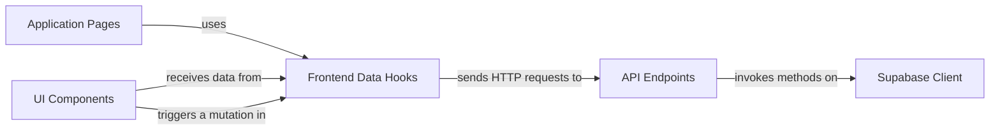

## Details

One paragraph explaining the functionality which is represented by this graph. What the main flow is and what is its purpose.

### Supabase Client
The core data abstraction layer. This singleton module directly interfaces with the Supabase BaaS for all database operations (CRUD on `mods`) and user authentication (sign-in, sign-out, session management). It centralizes all backend communication.

**Related Classes/Methods**:

- `src/lib/supabaseClient.ts`

### API Endpoints
A set of serverless Next.js API routes that act as a secure Backend-for-Frontend (BFF). They receive requests from the client, use the `Supabase Client` to perform actions, and enforce business logic or security rules before returning data.

**Related Classes/Methods**:

- `pages/api/mods/index.ts`
- `pages/api/mods/[id].ts`

### Frontend Data Hooks
Custom hooks built with TanStack Query that manage server state on the client. They encapsulate the logic for fetching, caching, and mutating data via the `API Endpoints`, providing a clean, declarative interface for UI components.

**Related Classes/Methods**:

- `src/hooks/useMods.ts`
- `src/hooks/useCreateMod.ts`

### UI Components
Reusable React components responsible for rendering the user interface. This includes presentational components like `TextmodCard` and stateful, interactive components like `ModForm` for content submission.

**Related Classes/Methods**:

- `src/components/ModForm.tsx`
- `src/components/TextmodCard.tsx`

### Application Pages
Top-level Next.js page components that compose the application's views. They integrate `UI Components` and connect them to `Frontend Data Hooks` to build the user experience for browsing, viewing, and creating mods.

**Related Classes/Methods**:

- `src/pages/index.tsx`
- `src/pages/mods/[id].tsx`
- `src/pages/submit.tsx`

### [FAQ](https://github.com/CodeBoarding/GeneratedOnBoardings/tree/main?tab=readme-ov-file#faq)