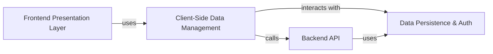

## Details

One paragraph explaining the functionality which is represented by this graph. What the main flow is and what is its purpose.

### Frontend Presentation Layer
This component is responsible for rendering the entire user interface and handling all user interactions. It is built with Next.js and React and includes all pages, UI components (like ModForm and TextmodCard), and the main application shell. It manages client-side routing and visual state.

**Related Classes/Methods**:

- `src/pages/index.tsx`
- `src/pages/_app.tsx`
- `src/components/ModForm.tsx`
- `src/components/TextmodCard.tsx`
- `src/components/ui/`

### Client-Side Data Management
A logical layer that orchestrates all client-side data operations. Implemented as a collection of custom React hooks (e.g., useTextmodsQuery, useUser), it uses TanStack Query to manage asynchronous state, caching, and data fetching, providing a reactive and efficient connection between the UI and backend services.

**Related Classes/Methods**:

- `src/hooks/useTextmodsQuery.ts`
- `src/hooks/useTextmodSearch.ts`
- `src/hooks/useUser.ts`

### Backend API
A set of serverless functions deployed as Next.js API routes. This component serves as a secure, lightweight backend proxy that handles requests requiring server-side logic or protected credentials, such as fetching aggregated content lists (top, latest) before querying the database.

**Related Classes/Methods**:

- `src/pages/api/mods/latest.ts`
- `src/pages/api/mods/top.ts`

### Data Persistence & Auth [[Expand]](./Data_Persistence_Auth.md)
The core Backend-as-a-Service (BaaS) provided by Supabase. This component is responsible for all persistent data storage (user-generated mods) and handles user authentication and session management. All interactions with this service are centralized through a dedicated client module.

**Related Classes/Methods**:

- `src/lib/supabaseClient.ts`

### [FAQ](https://github.com/CodeBoarding/GeneratedOnBoardings/tree/main?tab=readme-ov-file#faq)