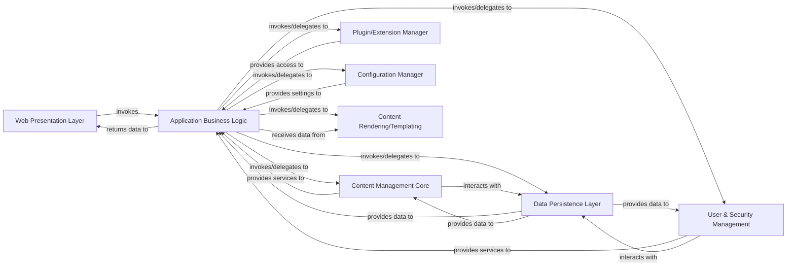

## Details

The relationships involving the Data Persistence Layer have been revised to adhere to the "maximum 2 relationships per component pair" criterion. Specifically: Application Business Logic and Data Persistence Layer: The redundant (Application Business Logic, sends data to, Data Persistence Layer) relationship was removed. The invokes/delegates to relationship implies the ability to initiate data persistence operations, including sending data. Content Management Core and Data Persistence Layer: The redundant (Content Management Core, sends data to, Data Persistence Layer) relationship was removed. The interacts with relationship implies bidirectional communication and data flow. User & Security Management and Data Persistence Layer: The redundant (User & Security Management, sends data to, Data Persistence Layer) relationship was removed. The interacts with relationship implies bidirectional communication and data flow.

### Web Presentation Layer [[Expand]](./Web_Presentation_Layer.md)
Handles user interface rendering, processes user requests, and manages user interactions. It translates user actions into business operations and displays the results.

**Related Classes/Methods**: _None_

### Application Business Logic [[Expand]](./Application_Business_Logic.md)
Encapsulates the core business rules and orchestrates complex operations. It coordinates interactions between the presentation, content, security, and data persistence layers, applying business workflows.

**Related Classes/Methods**: _None_

### Content Management Core
Manages the lifecycle of content, including creation, retrieval, updating, and deletion. It provides the fundamental services for content storage and organization within the CMS.

**Related Classes/Methods**: _None_

### User & Security Management
Handles user authentication, authorization, role management, and access control lists (ACLs). Ensures secure access to system resources and content based on user permissions.

**Related Classes/Methods**: _None_

### Data Persistence Layer [[Expand]](./Data_Persistence_Layer.md)
Provides an abstraction for data storage and retrieval, interacting with underlying storage mechanisms such as JDBC and file-based storage. It isolates the business logic from specific database technologies.

**Related Classes/Methods**: _None_

### Plugin/Extension Manager
Manages the loading, lifecycle, and invocation of various plugins (e.g., storage, RSS, search, rendering). This component is crucial for the system's extensibility and modularity.

**Related Classes/Methods**: _None_

### Configuration Manager
Manages system configuration settings, externalizing parameters for flexible deployment and operation. It provides a centralized way to access system-wide settings.

**Related Classes/Methods**: _None_

### Content Rendering/Templating
Responsible for transforming raw content and data into presentable formats, utilizing templates (e.g., JSP) and rendering engines (e.g., Radeox, custom macro engine).

**Related Classes/Methods**: _None_

### [FAQ](https://github.com/CodeBoarding/GeneratedOnBoardings/tree/main?tab=readme-ov-file#faq)