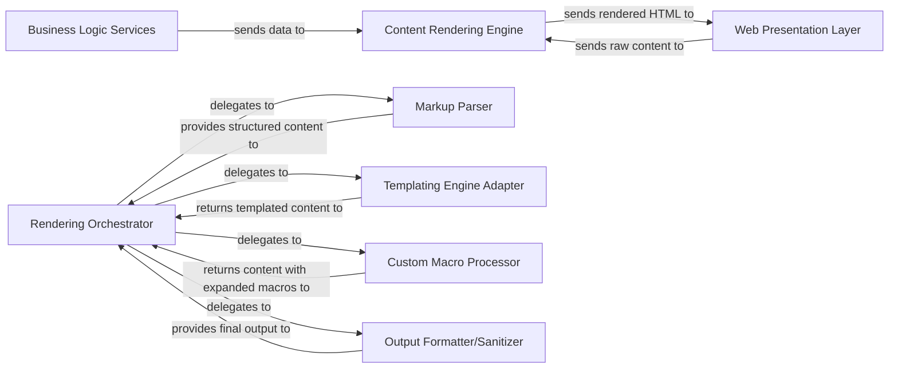

## Details

Analysis of abstract components and their relationships within a content rendering system.

### Content Rendering Engine [[Expand]](./Content_Rendering_Engine.md)
Transforms raw content (e.g., wiki markup, blog post text) into displayable formats, typically HTML, utilizing templating engines and a custom macro engine. This component is central to presenting dynamic and formatted content to users within the web application.

**Related Classes/Methods**: _None_

### Rendering Orchestrator
The core component responsible for managing the entire content rendering pipeline. It receives raw content, coordinates the parsing, templating, and macro expansion processes, and assembles the final displayable output.

**Related Classes/Methods**: _None_

### Markup Parser
Interprets and parses various raw content formats (e.g., wiki markup, plain text with specific syntax) into a structured intermediate representation (e.g., an Abstract Syntax Tree or a document object model) that can be further processed.

**Related Classes/Methods**: _None_

### Templating Engine Adapter
Provides an abstraction layer for integrating and utilizing external templating libraries (like Radeox, or Jinja2 in a Python context). It applies predefined presentation templates to the parsed content to generate a structured layout.

**Related Classes/Methods**: _None_

### Custom Macro Processor
Implements the logic for the custom macro engine. It identifies and expands application-specific macros embedded within the content, transforming them into dynamic elements or pre-defined content snippets.

**Related Classes/Methods**: _None_

### Output Formatter/Sanitizer
Performs final formatting, sanitization (to prevent security vulnerabilities like XSS), and conversion of the processed content into the target display format, typically HTML.

**Related Classes/Methods**: _None_

### Web Presentation Layer [[Expand]](./Web_Presentation_Layer.md)
This component is responsible for handling user interface interactions, rendering web pages, and managing the flow of data between the client (web browser) and the backend. It typically includes web frameworks, templating engines, and static asset management.

**Related Classes/Methods**: _None_

### Business Logic Services
This component encapsulates the core business rules, processes, and data operations. It interacts with data storage, external services, and provides data and functionality to the presentation layer or other consuming services.

**Related Classes/Methods**: _None_

### [FAQ](https://github.com/CodeBoarding/GeneratedOnBoardings/tree/main?tab=readme-ov-file#faq)