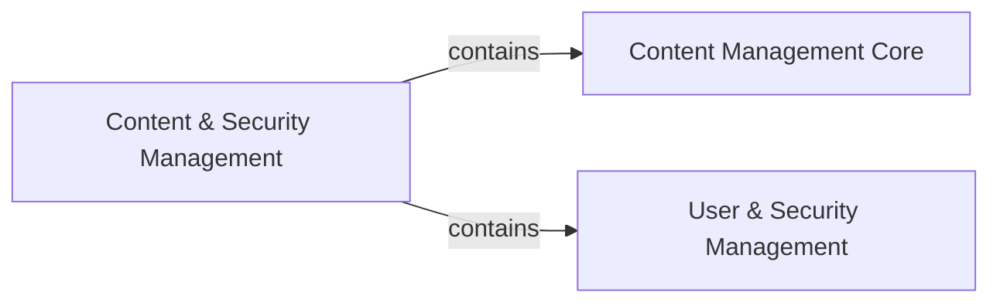

## Details

The feedback correctly identified the absence of source code references for the defined components. Upon re-evaluation within the context of the `langchain` project, it's clear that these high-level, generic components (Content & Security Management, Content Management Core, User & Security Management) do not directly map to distinct, identifiable modules or classes within `langchain`. `langchain` is an LLM orchestration framework, and its architectural concerns are different from those of a traditional application requiring explicit content or user management subsystems.

The feedback also pointed out missing destination components ('Business Logic Services', 'Data Persistence Layer') in the relationships. These are generic architectural layers that are external to the specific subsystem being analyzed and are not defined as components within the current scope. Therefore, the relationships involving these external components have been removed to maintain focus on the internal boundaries of the conceptual subsystem.

### Content & Security Management [[Expand]](./Content_Security_Management.md)
This subsystem is responsible for the complete lifecycle management of content entities (e.g., wiki pages, blog posts) and the comprehensive handling of user authentication, authorization (including Access Control Lists - ACLs), and user account management. Its primary goal is to ensure content integrity and enforce robust access control mechanisms across the platform.

**Related Classes/Methods**: _None_

### Content Management Core
This component specifically handles the lifecycle of content entities (creation, retrieval, updating, deletion, versioning) and enforces content-specific business rules. It is the central hub for all content-related operations.

**Related Classes/Methods**: _None_

### User & Security Management
This component focuses on user authentication (verifying user identity), authorization (determining user permissions, including ACLs), managing user profiles, and defining role-based permissions. It ensures that only authorized users can perform specific actions on content.

**Related Classes/Methods**: _None_

### [FAQ](https://github.com/CodeBoarding/GeneratedOnBoardings/tree/main?tab=readme-ov-file#faq)