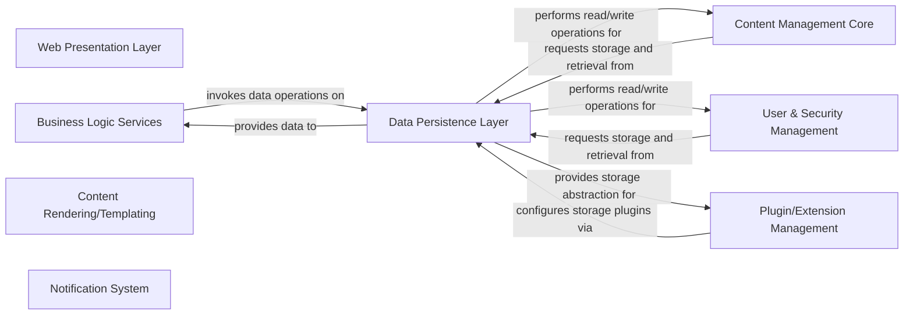

## Details

This analysis describes the architectural components and their interactions within a Content Management System (CMS). The project appears to be implemented in Java, as indicated by technologies like JSP, JDBC, and Radeox. Therefore, Python-specific source code retrieval tools are not applicable for this analysis.

### Web Presentation Layer [[Expand]](./Web_Presentation_Layer.md)
Handles user interface rendering using JSP, processes user input, and manages the flow of web requests and responses. It serves as the primary interface for user interaction.

**Related Classes/Methods**: _None_

### Business Logic Services
Encapsulates the core business rules and workflows of the application. It processes requests from the presentation layer, orchestrates operations across various components, and interacts with the Data Persistence Layer to fulfill application requirements.

**Related Classes/Methods**: _None_

### Content Management Core
The central component responsible for managing the lifecycle of content, including creation, editing, publishing, and organization. It acts as the primary orchestrator for content-related operations within the CMS.

**Related Classes/Methods**: _None_

### User & Security Management
Manages user accounts, authentication, authorization, and access control lists (ACLs). It ensures secure access to content and application features, handling user-specific data and permissions.

**Related Classes/Methods**: _None_

### Data Persistence Layer [[Expand]](./Data_Persistence_Layer.md)
Provides an abstract interface for interacting with various data storage mechanisms (file-based, JDBC). It isolates the rest of the application from the specifics of data storage and retrieval for content, user information, and configurations.

**Related Classes/Methods**: _None_

### Plugin/Extension Management
Manages the loading, lifecycle, and interaction of various plugins (e.g., storage, RSS, search, rendering). It provides the framework for extending application functionality without modifying the core system.

**Related Classes/Methods**: _None_

### Content Rendering/Templating
Responsible for transforming raw content data into presentable formats using templating engines like Radeox and a custom macro engine. It handles the dynamic generation of HTML or other output for display to users.

**Related Classes/Methods**: _None_

### Notification System
Handles sending notifications and messages, potentially integrating with external messaging services like Jabber. It ensures users or other systems are informed of relevant events within the application.

**Related Classes/Methods**: _None_

### [FAQ](https://github.com/CodeBoarding/GeneratedOnBoardings/tree/main?tab=readme-ov-file#faq)