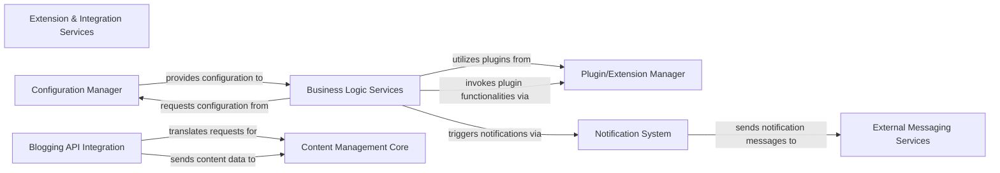

## Details

This overarching component is responsible for extending the core system's capabilities through a robust plugin architecture and enabling seamless communication with external services. It centralizes the management of various plugin types, integrates with external blogging platforms, handles system-wide notifications, and provides a unified mechanism for configuration management. Its fundamental architectural importance lies in promoting modularity, extensibility, and interoperability, allowing the system to adapt to diverse requirements and interact with a broader ecosystem.

### Extension & Integration Services [[Expand]](./Extension_Integration_Services.md)
This overarching component is responsible for extending the core system's capabilities through a robust plugin architecture and enabling seamless communication with external services. It centralizes the management of various plugin types, integrates with external blogging platforms, handles system-wide notifications, and provides a unified mechanism for configuration management. Its fundamental architectural importance lies in promoting modularity, extensibility, and interoperability, allowing the system to adapt to diverse requirements and interact with a broader ecosystem.

**Related Classes/Methods**: _None_

### Plugin/Extension Manager
Manages the discovery, loading, and lifecycle of various plugins (storage, RSS, search, rendering). It provides the framework for extending the system's functionality without modifying the core codebase.

**Related Classes/Methods**: _None_

### Blogging API Integration
Provides standardized interfaces (e.g., XML-RPC) for external blogging clients to interact with the platform, enabling content publishing and management from third-party applications.

**Related Classes/Methods**: _None_

### Notification System
Handles the dispatch of system-generated notifications and integrates with external messaging services (e.g., Jabber) to inform users or external systems about events.

**Related Classes/Methods**: _None_

### Configuration Manager
Provides a centralized mechanism for accessing and managing externalized application settings and configurations, ensuring system-wide consistency and flexibility.

**Related Classes/Methods**: _None_

### Business Logic Services
Encapsulates the core business rules and operations of the system, interacting with various other components to fulfill application requirements.

**Related Classes/Methods**: _None_

### Content Management Core
Manages the storage, retrieval, and organization of content within the system, serving as the central repository for all content-related data.

**Related Classes/Methods**: _None_

### External Messaging Services
Represents external systems or APIs responsible for sending messages (e.g., email, chat, push notifications) outside the primary application boundaries.

**Related Classes/Methods**: _None_

### [FAQ](https://github.com/CodeBoarding/GeneratedOnBoardings/tree/main?tab=readme-ov-file#faq)