```mermaid
graph LR
    Web_Presentation_Layer["Web Presentation Layer"]
    Business_Logic_Services["Business Logic Services"]
    User_and_Security_Management["User and Security Management"]
    Data_Persistence_Layer["Data Persistence Layer"]
    Content_Management_Core["Content Management Core"]
    Plugin_Extension_Management["Plugin/Extension Management"]
    Content_Rendering_Templating["Content Rendering/Templating"]
    Notification_System["Notification System"]
    Web_Presentation_Layer -- "invokes" --> Business_Logic_Services
    Web_Presentation_Layer -- "requests authentication/authorization from" --> User_and_Security_Management
    Business_Logic_Services -- "returns data and status to" --> Web_Presentation_Layer
    Business_Logic_Services -- "interacts with" --> Data_Persistence_Layer
    User_and_Security_Management -- "provides session/permissions to" --> Web_Presentation_Layer
    User_and_Security_Management -- "manages user data in" --> Data_Persistence_Layer
    Data_Persistence_Layer -- "stores/retrieves data for" --> Business_Logic_Services
    Data_Persistence_Layer -- "stores/retrieves user data for" --> User_and_Security_Management
    Content_Management_Core -- "utilizes" --> Data_Persistence_Layer
    Content_Management_Core -- "integrates extensions via" --> Plugin_Extension_Management
    Plugin_Extension_Management -- "registers/activates extensions for" --> Content_Management_Core
    Plugin_Extension_Management -- "provides extensions to" --> Content_Rendering_Templating
    Content_Rendering_Templating -- "processes content from" --> Content_Management_Core
    Content_Rendering_Templating -- "outputs rendered content to" --> Web_Presentation_Layer
    Notification_System -- "sends notifications from" --> Business_Logic_Services
    Notification_System -- "integrates with" --> User_and_Security_Management
    click Web_Presentation_Layer href "https://github.com/CodeBoarding/GeneratedOnBoardings/blob/main/snipsnap/Web_Presentation_Layer.md" "Details"
    click Data_Persistence_Layer href "https://github.com/CodeBoarding/GeneratedOnBoardings/blob/main/snipsnap/Data_Persistence_Layer.md" "Details"
```

## Details

One paragraph explaining the functionality which is represented by this graph. What the main flow is and what is its purpose.

### Web Presentation Layer [[Expand]](./Web_Presentation_Layer.md)
The user-facing component handling HTTP requests, managing user sessions, and rendering dynamic web pages (JSPs). It serves as the primary entry point for user interactions, acting as the View and Controller in an MVC pattern.

**Related Classes/Methods**: _None_

### Business Logic Services
Encapsulates the core business rules and operations of the application. It processes requests from the presentation layer, orchestrates complex workflows, and interacts with data and other services.

**Related Classes/Methods**: _None_

### User and Security Management
Manages user authentication, authorization, user profiles, and access control lists (ACLs). It ensures secure access to application resources and functionalities.

**Related Classes/Methods**: _None_

### Data Persistence Layer [[Expand]](./Data_Persistence_Layer.md)
Responsible for abstracting data storage and retrieval mechanisms (e.g., JDBC, file-based storage). It provides an interface for business logic to interact with the underlying data sources without knowing the specifics of their implementation.

**Related Classes/Methods**: _None_

### Content Management Core
The central component for managing content lifecycle, including creation, editing, versioning, and retrieval. It defines interfaces for various content-related plugins and utilizes the Plugin/Extension Management for integrating these extensions.

**Related Classes/Methods**: _None_

### Plugin/Extension Management
Provides mechanisms for dynamically loading, managing, and integrating various plugins (e.g., storage, RSS, search, rendering). It registers and activates extensions that enhance the functionality of components like Content Management Core and Content Rendering/Templating.

**Related Classes/Methods**: _None_

### Content Rendering/Templating
Handles the transformation of raw content into displayable formats, utilizing templating engines (e.g., JSP, Radeox, custom macro engine). It prepares content for presentation to the user.

**Related Classes/Methods**: _None_

### Notification System
Manages event-driven communications and notifications (e.g., Jabber). It allows different parts of the system or external services to send and receive messages.

**Related Classes/Methods**: _None_

### [FAQ](https://github.com/CodeBoarding/GeneratedOnBoardings/tree/main?tab=readme-ov-file#faq)