```mermaid
graph LR
    Web_Presentation_Layer["Web Presentation Layer"]
    Application_Business_Logic["Application Business Logic"]
    Content_Security_Management["Content & Security Management"]
    Data_Persistence_Layer["Data Persistence Layer"]
    Content_Rendering_Engine["Content Rendering Engine"]
    Extension_Integration_Services["Extension & Integration Services"]
    Web_Presentation_Layer -- "initiates requests to" --> Application_Business_Logic
    Web_Presentation_Layer -- "directly uses" --> Content_Rendering_Engine
    Application_Business_Logic -- "orchestrates calls to" --> Content_Security_Management
    Application_Business_Logic -- "utilizes" --> Data_Persistence_Layer
    Application_Business_Logic -- "triggers events handled by" --> Extension_Integration_Services
    Content_Security_Management -- "relies on" --> Data_Persistence_Layer
    Content_Security_Management -- "may use" --> Content_Rendering_Engine
    Extension_Integration_Services -- "delegates processing to" --> Application_Business_Logic
    Extension_Integration_Services -- "integrates plugins interacting with" --> Data_Persistence_Layer
    click Web_Presentation_Layer href "https://github.com/CodeBoarding/GeneratedOnBoardings/blob/main/snipsnap/Web_Presentation_Layer.md" "Details"
    click Application_Business_Logic href "https://github.com/CodeBoarding/GeneratedOnBoardings/blob/main/snipsnap/Application_Business_Logic.md" "Details"
    click Content_Security_Management href "https://github.com/CodeBoarding/GeneratedOnBoardings/blob/main/snipsnap/Content_Security_Management.md" "Details"
    click Data_Persistence_Layer href "https://github.com/CodeBoarding/GeneratedOnBoardings/blob/main/snipsnap/Data_Persistence_Layer.md" "Details"
    click Content_Rendering_Engine href "https://github.com/CodeBoarding/GeneratedOnBoardings/blob/main/snipsnap/Content_Rendering_Engine.md" "Details"
    click Extension_Integration_Services href "https://github.com/CodeBoarding/GeneratedOnBoardings/blob/main/snipsnap/Extension_Integration_Services.md" "Details"
```

## Details

One paragraph explaining the functionality which is represented by this graph. What the main flow is and what is its purpose.

### Web Presentation Layer [[Expand]](./Web_Presentation_Layer.md)
The user-facing component responsible for handling HTTP requests, managing user sessions, and rendering dynamic web pages (JSPs). It acts as the primary entry point for user interactions.

**Related Classes/Methods**: _None_

### Application Business Logic [[Expand]](./Application_Business_Logic.md)
Encapsulates the core business rules and orchestrates complex operations. It coordinates interactions between the presentation, content, security, and data persistence layers, applying business workflows.

**Related Classes/Methods**: _None_

### Content & Security Management [[Expand]](./Content_Security_Management.md)
Manages the lifecycle of all content entities (e.g., wiki pages, blog posts) and handles user authentication, authorization (including ACLs), and user account management. It ensures content integrity and access control.

**Related Classes/Methods**: _None_

### Data Persistence Layer [[Expand]](./Data_Persistence_Layer.md)
Provides an abstract interface for interacting with various data storage mechanisms (file-based, JDBC). It isolates the rest of the application from the specifics of data storage and retrieval.

**Related Classes/Methods**: _None_

### Content Rendering Engine [[Expand]](./Content_Rendering_Engine.md)
Transforms raw content (e.g., wiki markup, blog post text) into displayable formats, typically HTML, utilizing templating engines like Radeox and a custom macro engine.

**Related Classes/Methods**: _None_

### Extension & Integration Services [[Expand]](./Extension_Integration_Services.md)
Manages the discovery, loading, and lifecycle of various plugins (storage, RSS, rendering) and facilitates communication with external systems, including blogging APIs (XML-RPC) and notification services (Jabber). It also handles system-wide configuration loading.

**Related Classes/Methods**: _None_

### [FAQ](https://github.com/CodeBoarding/GeneratedOnBoardings/tree/main?tab=readme-ov-file#faq)