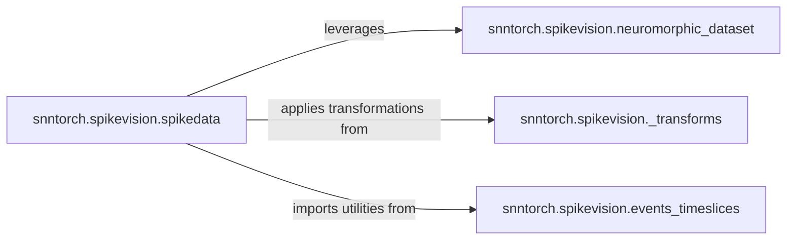

## Details

The `snntorch.spikevision` subsystem is designed around a modular data processing pipeline for neuromorphic datasets. The `neuromorphic_dataset` component establishes a common base for handling dataset fundamentals, including downloading and initial setup. Building upon this, `spikedata` acts as a plugin-oriented component, with specialized submodules for different neuromorphic datasets, each handling unique loading and conversion logic. These `spikedata` modules leverage the foundational capabilities of `neuromorphic_dataset` and apply a variety of data transformations provided by the `_transforms` component. Furthermore, `spikedata` imports utilities from `events_timeslices`, which is dedicated to low-level event data processing, enabling the conversion of raw event streams into structured formats like binary frames, crucial for preparing data for SNN models. This architecture ensures a flexible and extensible system for managing and preparing diverse neuromorphic data.

### snntorch.spikevision.neuromorphic_dataset
This component serves as the foundational utility for generic neuromorphic dataset management. It encapsulates common tasks such as downloading datasets, performing integrity checks (MD5), extracting archives, and setting up initial data structures (e.g., HDF5 files). It provides a standardized base for specific dataset implementations, ensuring consistency in data handling.

**Related Classes/Methods**:

- <a href="https://github.com/jeshraghian/snntorch/blob/master/snntorch/spikevision/neuromorphic_dataset.py" target="_blank" rel="noopener noreferrer">`snntorch.spikevision.neuromorphic_dataset`</a>

### snntorch.spikevision.spikedata
This component acts as an extension point (Plugin Pattern) for specialized neuromorphic datasets. Each submodule within `spikedata` (e.g., `dvs_gesture`, `nmnist`, `shd`) is responsible for its unique data loading, HDF5 conversion, and sampling logic, adapting to the specific format and characteristics of that dataset. It leverages `neuromorphic_dataset` for foundational tasks and applies transformations from `_transforms`. It also imports utilities from `events_timeslices` for event data processing.

**Related Classes/Methods**:

- <a href="https://github.com/jeshraghian/snntorch/blob/master/snntorch/spikevision/spikedata" target="_blank" rel="noopener noreferrer">`snntorch.spikevision.spikedata`</a>

### snntorch.spikevision.events_timeslices
This component focuses on low-level, granular processing of event-based data. It provides utilities to extract specific time slices or convert raw event streams into binary frames, which are essential preprocessing steps for certain SNN models that require frame-based input.

**Related Classes/Methods**:

- <a href="https://github.com/jeshraghian/snntorch/blob/master/snntorch/spikevision/events_timeslices.py" target="_blank" rel="noopener noreferrer">`snntorch.spikevision.events_timeslices`</a>

### snntorch.spikevision._transforms
This component provides a modular collection of reusable data transformation utilities (e.g., `dvs_permute`, `ToTensor`, `Repeat`). These transformations are vital for standardizing, augmenting, and preparing diverse neuromorphic data into a consistent format suitable for consumption by SNNs, aligning with the Pipeline Pattern.

**Related Classes/Methods**:

- <a href="https://github.com/jeshraghian/snntorch/blob/master/snntorch/spikevision/_transforms.py" target="_blank" rel="noopener noreferrer">`snntorch.spikevision._transforms`</a>

### [FAQ](https://github.com/CodeBoarding/GeneratedOnBoardings/tree/main?tab=readme-ov-file#faq)