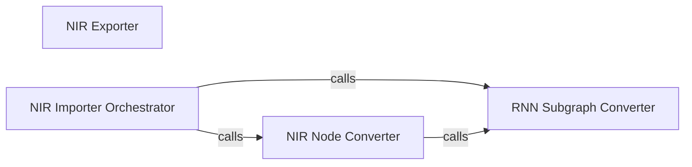

## Details

The `Model Interoperability (NIR)` subsystem facilitates the exchange and conversion of SNN models with other neuromorphic frameworks using the Neuromorphic Intermediate Representation (NIR) standard.

### NIR Exporter
This component is responsible for recursively traversing a `snntorch` model, extracting its modules and parameters, and mapping them into a format compatible with the NIR standard. It serializes `snntorch` models for external use and interoperability.

**Related Classes/Methods**:

- <a href="https://github.com/jeshraghian/snntorch/blob/master/snntorch/export_nir.py" target="_blank" rel="noopener noreferrer">`snntorch.export_nir:_extract_snntorch_module`</a>

### NIR Importer Orchestrator
Serves as the primary entry point for converting a NIR model into a `snntorch` compatible structure. It orchestrates the overall import process, delegating specific conversion tasks to other internal components based on the type of NIR nodes encountered.

**Related Classes/Methods**:

- <a href="https://github.com/jeshraghian/snntorch/blob/master/snntorch/import_nir.py" target="_blank" rel="noopener noreferrer">`snntorch.import_nir:import_from_nir`</a>

### NIR Node Converter
Performs the fundamental conversion of individual NIR nodes or components (e.g., layers, activation functions, basic operations) into their corresponding `snntorch` module equivalents. This component embodies the core mapping logic for non-RNN components and also initiates specialized handling for complex structures like RNNs.

**Related Classes/Methods**:

- <a href="https://github.com/jeshraghian/snntorch/blob/master/snntorch/import_nir.py" target="_blank" rel="noopener noreferrer">`snntorch.import_nir:_nir_to_snntorch_module`</a>

### RNN Subgraph Converter
Specializes in identifying, parsing, and transforming recurrent neural network (RNN) subgraphs within the incoming NIR representation into `snntorch`'s specific RNN implementations. This addresses the complexity of stateful components during the import process, consolidating the logic for RNN-specific conversions.

**Related Classes/Methods**:

- <a href="https://github.com/jeshraghian/snntorch/blob/master/snntorch/import_nir.py" target="_blank" rel="noopener noreferrer">`snntorch.import_nir:_replace_rnn_subgraph_with_nirgraph`</a>
- <a href="https://github.com/jeshraghian/snntorch/blob/master/snntorch/import_nir.py" target="_blank" rel="noopener noreferrer">`snntorch.import_nir:_create_rnn_subgraph`</a>
- <a href="https://github.com/jeshraghian/snntorch/blob/master/snntorch/import_nir.py" target="_blank" rel="noopener noreferrer">`snntorch.import_nir:_parse_rnn_subgraph`</a>

### [FAQ](https://github.com/CodeBoarding/GeneratedOnBoardings/tree/main?tab=readme-ov-file#faq)