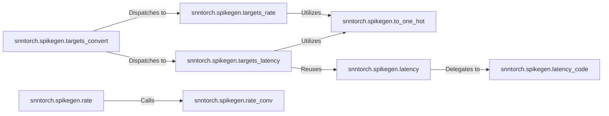

## Details

The `Spike Encoding Layer` subsystem is primarily encapsulated within the `snntorch.spikegen` package, specifically within the `snntorch/snntorch/spikegen.py` file. Its core responsibility is to transform diverse input data and target labels into spike trains, which are the native input format for Spiking Neural Networks (SNNs).

### snntorch.spikegen.rate
Provides a high-level interface for converting continuous or discrete input data into spike trains using rate coding. It serves as a primary entry point for users to apply rate-based encoding.

**Related Classes/Methods**:

- <a href="https://github.com/jeshraghian/snntorch/blob/master/snntorch/spikegen.py" target="_blank" rel="noopener noreferrer">`snntorch.spikegen.rate`</a>

### snntorch.spikegen.latency
Offers a high-level interface for converting input data into spike trains using latency coding. It is a key entry point for users to apply latency-based encoding.

**Related Classes/Methods**:

- <a href="https://github.com/jeshraghian/snntorch/blob/master/snntorch/spikegen.py#L154-L330" target="_blank" rel="noopener noreferrer">`snntorch.spikegen.latency`:154-330</a>

### snntorch.spikegen.targets_convert
Acts as an orchestrator for converting target labels into spike trains, abstracting the specific encoding method (rate or latency). It dispatches the conversion task to the appropriate specialized function based on the chosen encoding type.

**Related Classes/Methods**:

- <a href="https://github.com/jeshraghian/snntorch/blob/master/snntorch/spikegen.py#L714-L872" target="_blank" rel="noopener noreferrer">`snntorch.spikegen.targets_convert`:714-872</a>

### snntorch.spikegen.targets_rate
Implements the specific logic for converting target labels into rate-coded spike trains, including any necessary preprocessing steps like one-hot encoding.

**Related Classes/Methods**:

- <a href="https://github.com/jeshraghian/snntorch/blob/master/snntorch/spikegen.py#L875-L1134" target="_blank" rel="noopener noreferrer">`snntorch.spikegen.targets_rate`:875-1134</a>

### snntorch.spikegen.targets_latency
Handles the specific logic for converting target labels into latency-coded spike trains, including preprocessing and potentially reusing existing data encoding mechanisms.

**Related Classes/Methods**:

- <a href="https://github.com/jeshraghian/snntorch/blob/master/snntorch/spikegen.py#L1402-L1529" target="_blank" rel="noopener noreferrer">`snntorch.spikegen.targets_latency`:1402-1529</a>

### snntorch.spikegen.rate_conv
Encapsulates the fundamental algorithm for converting raw data into rate-coded spike trains. This is a core implementation detail for rate encoding.

**Related Classes/Methods**:

- <a href="https://github.com/jeshraghian/snntorch/blob/master/snntorch/spikegen.py#L400-L439" target="_blank" rel="noopener noreferrer">`snntorch.spikegen.rate_conv`:400-439</a>

### snntorch.spikegen.latency_code
Implements the fundamental algorithm for converting raw data into latency-coded spike trains. This is a core implementation detail for latency encoding.

**Related Classes/Methods**:

- <a href="https://github.com/jeshraghian/snntorch/blob/master/snntorch/spikegen.py#L442-L527" target="_blank" rel="noopener noreferrer">`snntorch.spikegen.latency_code`:442-527</a>

### snntorch.spikegen.to_one_hot
Provides a generic utility function for converting categorical data into a one-hot encoded format, a common preprocessing step for various encoding methods.

**Related Classes/Methods**:

- <a href="https://github.com/jeshraghian/snntorch/blob/master/snntorch/spikegen.py#L1552-L1591" target="_blank" rel="noopener noreferrer">`snntorch.spikegen.to_one_hot`:1552-1591</a>

### [FAQ](https://github.com/CodeBoarding/GeneratedOnBoardings/tree/main?tab=readme-ov-file#faq)