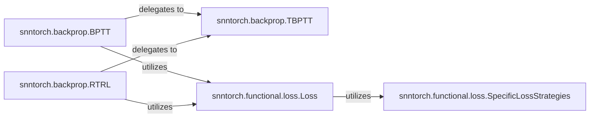

## Details

The `Training & Optimization Engine` subsystem in `snntorch` is responsible for providing the core algorithms and utilities necessary for training Spiking Neural Networks (SNNs). This includes various backpropagation methods and specialized loss functions tailored for SNNs.

### snntorch.backprop.TBPTT
This is a foundational component providing the core mechanism for backpropagation in SNNs. It handles the low-level gradient calculations over time, managing the unrolling of the network and computing gradients for each time step. It serves as a fundamental building block for other backpropagation algorithms.

**Related Classes/Methods**:

- <a href="https://github.com/jeshraghian/snntorch/blob/master/snntorch/backprop.py#L19-L374" target="_blank" rel="noopener noreferrer">`snntorch.backprop.TBPTT`:19-374</a>

### snntorch.backprop.BPTT
This component orchestrates the training process using the full Backpropagation Through Time algorithm. It manages the forward pass, implicitly handles loss calculation within a broader training loop, and initiates the backward pass by delegating to the core `TBPTT` mechanism.

**Related Classes/Methods**:

- <a href="https://github.com/jeshraghian/snntorch/blob/master/snntorch/backprop.py#L377-L487" target="_blank" rel="noopener noreferrer">`snntorch.backprop.BPTT`:377-487</a>

### snntorch.backprop.RTRL
This component implements the Real-Time Recurrent Learning (RTRL) algorithm, an online learning method specifically designed for recurrent networks. It manages its unique training dynamics, also leveraging the underlying `TBPTT` for its gradient computations.

**Related Classes/Methods**:

- <a href="https://github.com/jeshraghian/snntorch/blob/master/snntorch/backprop.py#L490-L600" target="_blank" rel="noopener noreferrer">`snntorch.backprop.RTRL`:490-600</a>

### snntorch.functional.loss.Loss
This component provides a comprehensive set of loss functions tailored for SNNs. It acts as a central manager or facade for various loss calculation strategies, handling the computation of discrepancies between network outputs and target labels. It delegates to specific loss implementations.

**Related Classes/Methods**:

- <a href="https://github.com/jeshraghian/snntorch/blob/master/snntorch/functional/loss.py" target="_blank" rel="noopener noreferrer">`snntorch.functional.loss.Loss`</a>

### snntorch.functional.loss.SpecificLossStrategies
These represent concrete implementations of different SNN loss criteria (e.g., `Tolerance`, `FirstSpike`). They provide the specific algorithms for computing various types of SNN loss, such as spike count or first spike time, used by the `Loss` component.

**Related Classes/Methods**:

- <a href="https://github.com/jeshraghian/snntorch/blob/master/snntorch/functional/loss.py" target="_blank" rel="noopener noreferrer">`snntorch.functional.loss.SpecificLossStrategies`</a>

### [FAQ](https://github.com/CodeBoarding/GeneratedOnBoardings/tree/main?tab=readme-ov-file#faq)