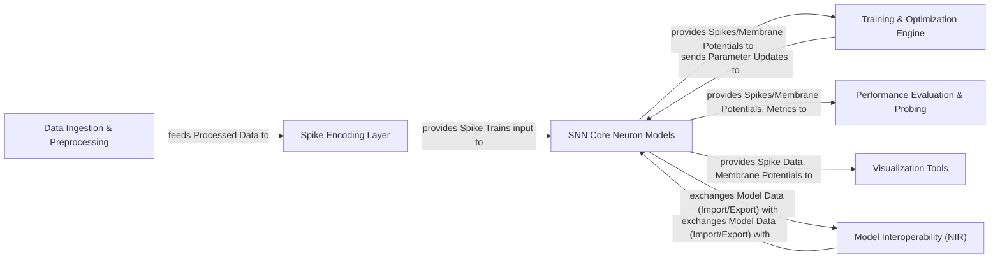

## Details

The `snntorch` library provides a comprehensive framework for building, training, and analyzing Spiking Neural Networks (SNNs). The architecture is modular, starting with `Data Ingestion & Preprocessing` to handle raw data, which then feeds into the `Spike Encoding Layer` to convert data into spike trains. These spike trains are processed by the `SNN Core Neuron Models`, the fundamental computational units. The `Training & Optimization Engine` facilitates the learning process by applying various backpropagation methods and loss functions. `Performance Evaluation & Probing` offers tools for assessing model performance and inspecting internal states. Finally, `Visualization Tools` aid in understanding and presenting SNN behavior, while the `Model Interoperability (NIR)` component ensures compatibility with other neuromorphic frameworks.

### Data Ingestion & Preprocessing [[Expand]](./Data_Ingestion_Preprocessing.md)
Handles the loading, transformation, and initial processing of neuromorphic datasets and other input data, preparing it for SNNs.

**Related Classes/Methods**:

- <a href="https://github.com/jeshraghian/snntorch/blob/master/snntorch/spikevision/events_timeslices.py" target="_blank" rel="noopener noreferrer">`snntorch.spikevision.events_timeslices`</a>
- <a href="https://github.com/jeshraghian/snntorch/blob/master/snntorch/spikevision/neuromorphic_dataset.py" target="_blank" rel="noopener noreferrer">`snntorch.spikevision.neuromorphic_dataset`</a>
- <a href="https://github.com/jeshraghian/snntorch/blob/master/snntorch/spikevision/spikedata/__init__.py" target="_blank" rel="noopener noreferrer">`snntorch.spikevision.spikedata`</a>

### Spike Encoding Layer [[Expand]](./Spike_Encoding_Layer.md)
Converts various forms of input data (e.g., images, sensor readings) into spike trains, the native input format for SNNs.

**Related Classes/Methods**:

- <a href="https://github.com/jeshraghian/snntorch/blob/master/snntorch/spikegen.py" target="_blank" rel="noopener noreferrer">`snntorch.spikegen.rate`</a>
- <a href="https://github.com/jeshraghian/snntorch/blob/master/snntorch/spikegen.py#L154-L330" target="_blank" rel="noopener noreferrer">`snntorch.spikegen.latency`:154-330</a>
- <a href="https://github.com/jeshraghian/snntorch/blob/master/snntorch/spikegen.py#L714-L872" target="_blank" rel="noopener noreferrer">`snntorch.spikegen.targets_convert`:714-872</a>
- <a href="https://github.com/jeshraghian/snntorch/blob/master/snntorch/spikegen.py#L875-L1134" target="_blank" rel="noopener noreferrer">`snntorch.spikegen.targets_rate`:875-1134</a>
- <a href="https://github.com/jeshraghian/snntorch/blob/master/snntorch/spikegen.py#L1402-L1529" target="_blank" rel="noopener noreferrer">`snntorch.spikegen.targets_latency`:1402-1529</a>

### SNN Core Neuron Models [[Expand]](./SNN_Core_Neuron_Models.md)
Implements a diverse range of spiking neuron models (e.g., Leaky Integrate-and-Fire, Alpha, Synaptic) that serve as the fundamental computational units of SNNs.

**Related Classes/Methods**:

- <a href="https://github.com/jeshraghian/snntorch/blob/master/snntorch/_neurons/lapicque.py" target="_blank" rel="noopener noreferrer">`snntorch._neurons.lapicque`</a>
- <a href="https://github.com/jeshraghian/snntorch/blob/master/snntorch/_neurons/leaky.py" target="_blank" rel="noopener noreferrer">`snntorch._neurons.leaky`</a>
- <a href="https://github.com/jeshraghian/snntorch/blob/master/snntorch/_neurons/alpha.py" target="_blank" rel="noopener noreferrer">`snntorch._neurons.alpha`</a>
- <a href="https://github.com/jeshraghian/snntorch/blob/master/snntorch/_neurons/rleaky.py" target="_blank" rel="noopener noreferrer">`snntorch._neurons.rleaky`</a>
- <a href="https://github.com/jeshraghian/snntorch/blob/master/snntorch/_neurons/rsynaptic.py" target="_blank" rel="noopener noreferrer">`snntorch._neurons.rsynaptic`</a>
- <a href="https://github.com/jeshraghian/snntorch/blob/master/snntorch/_neurons/sconv2dlstm.py" target="_blank" rel="noopener noreferrer">`snntorch._neurons.sconv2dlstm`</a>
- <a href="https://github.com/jeshraghian/snntorch/blob/master/snntorch/_neurons/slstm.py" target="_blank" rel="noopener noreferrer">`snntorch._neurons.slstm`</a>
- <a href="https://github.com/jeshraghian/snntorch/blob/master/snntorch/_neurons/synaptic.py" target="_blank" rel="noopener noreferrer">`snntorch._neurons.synaptic`</a>
- <a href="https://github.com/jeshraghian/snntorch/blob/master/snntorch/_neurons/neurons.py" target="_blank" rel="noopener noreferrer">`snntorch._neurons.neurons`</a>

### Training & Optimization Engine [[Expand]](./Training_Optimization_Engine.md)
Provides algorithms and utilities for training SNNs, including various backpropagation methods and specialized loss functions.

**Related Classes/Methods**:

- <a href="https://github.com/jeshraghian/snntorch/blob/master/snntorch/backprop.py#L377-L487" target="_blank" rel="noopener noreferrer">`snntorch.backprop.BPTT`:377-487</a>
- <a href="https://github.com/jeshraghian/snntorch/blob/master/snntorch/backprop.py#L490-L600" target="_blank" rel="noopener noreferrer">`snntorch.backprop.RTRL`:490-600</a>
- <a href="https://github.com/jeshraghian/snntorch/blob/master/snntorch/backprop.py#L19-L374" target="_blank" rel="noopener noreferrer">`snntorch.backprop.TBPTT`:19-374</a>
- <a href="https://github.com/jeshraghian/snntorch/blob/master/snntorch/functional/loss.py" target="_blank" rel="noopener noreferrer">`snntorch.functional.loss`</a>

### Performance Evaluation & Probing
Offers tools to measure the performance of SNNs (e.g., accuracy) and to inspect internal states during simulation or training.

**Related Classes/Methods**:

- <a href="https://github.com/jeshraghian/snntorch/blob/master/snntorch/functional/acc.py#L5-L27" target="_blank" rel="noopener noreferrer">`snntorch.functional.acc.accuracy_rate`:5-27</a>
- <a href="https://github.com/jeshraghian/snntorch/blob/master/snntorch/functional/acc.py#L30-L70" target="_blank" rel="noopener noreferrer">`snntorch.functional.acc.accuracy_temporal`:30-70</a>
- <a href="https://github.com/jeshraghian/snntorch/blob/master/snntorch/functional/probe.py" target="_blank" rel="noopener noreferrer">`snntorch.functional.probe`</a>

### Visualization Tools
Provides utilities for plotting and animating spike activity, membrane potentials, and other SNN-related data for analysis and presentation.

**Related Classes/Methods**:

- <a href="https://github.com/jeshraghian/snntorch/blob/master/snntorch/spikeplot.py#L15-L87" target="_blank" rel="noopener noreferrer">`snntorch.spikeplot.animator`:15-87</a>
- <a href="https://github.com/jeshraghian/snntorch/blob/master/snntorch/spikeplot.py#L123-L269" target="_blank" rel="noopener noreferrer">`snntorch.spikeplot.spike_count`:123-269</a>
- <a href="https://github.com/jeshraghian/snntorch/blob/master/snntorch/spikeplot.py#L453-L460" target="_blank" rel="noopener noreferrer">`snntorch.spikeplot.animate`:453-460</a>
- <a href="https://github.com/jeshraghian/snntorch/blob/master/snntorch/spikeplot.py#L440-L451" target="_blank" rel="noopener noreferrer">`snntorch.spikeplot.snap`:440-451</a>

### Model Interoperability (NIR) [[Expand]](./Model_Interoperability_NIR_.md)
Facilitates the exchange and conversion of SNN models with other neuromorphic frameworks using the Neuromorphic Intermediate Representation (NIR) standard.

**Related Classes/Methods**:

- <a href="https://github.com/jeshraghian/snntorch/blob/master/snntorch/export_nir.py#L13-L233" target="_blank" rel="noopener noreferrer">`snntorch.export_nir._extract_snntorch_module`:13-233</a>
- <a href="https://github.com/jeshraghian/snntorch/blob/master/snntorch/import_nir.py#L471-L520" target="_blank" rel="noopener noreferrer">`snntorch.import_nir.import_from_nir`:471-520</a>
- <a href="https://github.com/jeshraghian/snntorch/blob/master/snntorch/import_nir.py#L74-L109" target="_blank" rel="noopener noreferrer">`snntorch.import_nir._replace_rnn_subgraph_with_nirgraph`:74-109</a>
- <a href="https://github.com/jeshraghian/snntorch/blob/master/snntorch/import_nir.py#L164-L468" target="_blank" rel="noopener noreferrer">`snntorch.import_nir._nir_to_snntorch_module`:164-468</a>

### [FAQ](https://github.com/CodeBoarding/GeneratedOnBoardings/tree/main?tab=readme-ov-file#faq)