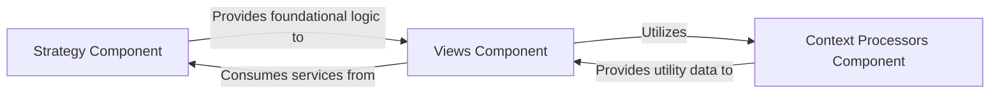

## Details

The `Authentication Flow & Strategy` subsystem is primarily concerned with adapting the generic social authentication process to the Django framework, managing user sessions, handling redirects, and orchestrating the user's journey through the authentication pipeline. Its boundaries are defined by the core files within the `social_django` package that implement these functionalities.

### Strategy Component
This component encapsulates the fundamental logic for adapting the generic social authentication process to the Django environment. It manages the creation and restoration of user sessions and provides utilities for rendering dynamic content (templates and HTML strings) within the authentication flow. It acts as an adapter, making the core `python-social-auth` logic compatible with Django's session and rendering mechanisms.

**Related Classes/Methods**:

- <a href="https://github.com/python-social-auth/social-app-django/blob/master/social_django/strategy.py" target="_blank" rel="noopener noreferrer">`social_django/strategy.py:create_session`</a>
- <a href="https://github.com/python-social-auth/social-app-django/blob/master/social_django/strategy.py" target="_blank" rel="noopener noreferrer">`social_django/strategy.py:restore_session`</a>
- <a href="https://github.com/python-social-auth/social-app-django/blob/master/social_django/strategy.py" target="_blank" rel="noopener noreferrer">`social_django/strategy.py:render_template_string`</a>
- <a href="https://github.com/python-social-auth/social-app-django/blob/master/social_django/strategy.py" target="_blank" rel="noopener noreferrer">`social_django/strategy.py:render_string`</a>
- <a href="https://github.com/python-social-auth/social-app-django/blob/master/social_django/strategy.py" target="_blank" rel="noopener noreferrer">`social_django/strategy.py:render_html`</a>

### Context Processors Component
This component is responsible for injecting dynamic context variables into Django templates. Crucially, it provides the `redirect` function, which determines and supplies the appropriate redirect URLs necessary for guiding the user through various stages of the authentication flow (e.g., post-login, error handling). This is a standard Django pattern used here to manage flow control via redirects.

**Related Classes/Methods**:

- <a href="https://github.com/python-social-auth/social-app-django/blob/master/social_django/context_processors.py" target="_blank" rel="noopener noreferrer">`social_django/context_processors.py:redirect`</a>

### Views Component
This component handles the web-facing interactions of the authentication flow. It orchestrates the login process, manages session timeouts, and coordinates with the `Strategy` and `Context Processors` components to ensure a smooth user journey through the authentication pipeline. As the "Controller" in an MVT pattern, it processes requests and prepares responses.

**Related Classes/Methods**:

- <a href="https://github.com/python-social-auth/social-app-django/blob/master/social_django/views.py" target="_blank" rel="noopener noreferrer">`social_django/views.py:_do_login`</a>
- <a href="https://github.com/python-social-auth/social-app-django/blob/master/social_django/views.py" target="_blank" rel="noopener noreferrer">`social_django/views.py:get_session_timeout`</a>

### [FAQ](https://github.com/CodeBoarding/GeneratedOnBoardings/tree/main?tab=readme-ov-file#faq)